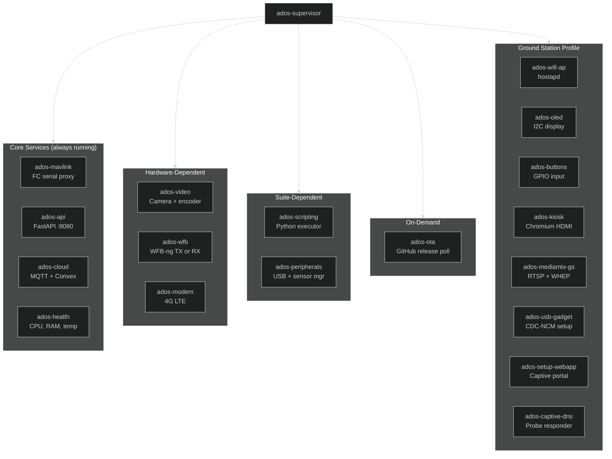

# Agent Services

The ADOS Drone Agent uses a multi-process architecture where each service runs as an independent systemd unit. A supervisor service manages the lifecycle. Services communicate through Unix domain sockets and share no memory.

## Why multi-process

A single Python asyncio process is simpler, but it has real drawbacks for a drone:

- A crashed video encoder takes down the MAVLink proxy. The flight controller loses its companion link.
- No per-service resource limits. A memory leak in one service starves the others.
- No per-service restart. Fixing a video pipeline issue requires restarting everything.

The multi-process design isolates failures. A crashed `ados-video` gets restarted by systemd in 3 seconds. The MAVLink proxy never notices.

## Service tree



The supervisor starts child services based on the active profile (air or ground-station) and the hardware detected. Services that depend on hardware not present are masked, not started.

## Systemd unit structure

Each service has a unit file in `/etc/systemd/system/`:

```ini
[Unit]
Description=ADOS MAVLink Proxy
After=ados-supervisor.service
PartOf=ados-supervisor.service

[Service]
Type=simple
User=ados
ExecStart=/opt/ados/venv/bin/python -m ados.services.mavlink
Restart=on-failure
RestartSec=3
MemoryMax=128M
CPUQuota=50%

[Install]
WantedBy=ados-supervisor.service
```

Key properties:

- **PartOf:** service stops when the supervisor stops
- **Restart=on-failure:** automatic restart on crash
- **MemoryMax / CPUQuota:** cgroup limits prevent any single service from starving the system

## IPC: Unix domain sockets

Services communicate through two Unix domain sockets in `/run/ados/`:

### MAVLink socket (`/run/ados/mavlink.sock`)

Binary protocol. Each frame is a 4-byte little-endian length prefix followed by raw MAVLink bytes.

```
| LENGTH (4 bytes, LE) | MAVLink v2 frame (LEN bytes) |
```

The MAVLink service writes decoded FC messages to this socket. Other services (cloud, scripting, API) read from it. This is a publish-subscribe pattern implemented over a Unix socket. Multiple readers get all messages.

### State socket (`/run/ados/state.sock`)

JSON protocol at 10 Hz. Each frame is a newline-delimited JSON object:

```json
{"ts": 1713270934.5, "mode": "LOITER", "armed": false, "alt": 45.2, "bat": 82, "gps_sats": 12}
```

The health service reads this to compute system metrics. The cloud service reads it for telemetry upload. The OLED service reads it for display rendering.

## Circuit breaker

The supervisor implements a circuit breaker pattern for each service. If a service crashes 5 times within 60 seconds, the breaker opens and the service is not restarted until a manual reset or a supervisor restart.

```
Normal → 5 failures in 60s → Breaker open → Manual reset or supervisor restart → Normal
```

When a breaker opens, the supervisor:

1. Logs a CRITICAL event
2. Sends a notification to Mission Control
3. Continues running all other services

A single bad service does not bring down the whole agent.

## Profile detection

On first boot (or when `agent.profile: auto` is set), the `profile_detect` module runs a score-based hardware fingerprint:

| Signal | Ground score | Air score |
|--------|-------------|-----------|
| I2C OLED at 0x3C or 0x3D | +3 | 0 |
| 4 GPIO buttons with pull-ups | +2 | 0 |
| RTL8812EU USB device | +1 | +1 |
| MAVLink serial device (ttyACM or UART) | 0 | +3 |
| GPS serial device | 0 | +2 |
| FC heartbeat received within 10 seconds | 0 | +3 |
| Known FC carrier board profile | 0 | +2 |

**Decision rules:**
- Ground score >= 4 AND air score <= 2: **ground-station** profile
- Air score >= 4 AND ground score <= 2: **air** profile
- Ambiguous: **unconfigured**, show pick-profile UI

The result is written to `/etc/ados/profile.conf` with the full fingerprint snapshot. Explicit `agent.profile:` in config.yaml always overrides detection.

## Service lifecycle per profile

<Tabs>
  <Tab title="Air profile">
    Always started:
    - `ados-supervisor`, `ados-mavlink`, `ados-api`, `ados-cloud`, `ados-health`

    Hardware-dependent:
    - `ados-video` (if camera detected)
    - `ados-wfb` in TX mode (if RTL8812EU detected)
    - `ados-modem` (if 4G modem detected)

    Suite-dependent:
    - `ados-scripting` (if a suite is activated)
    - `ados-peripherals` (if USB sensors detected)

    Masked (never started):
    - All ground-station services (wifi-ap, oled, buttons, kiosk, etc.)
  </Tab>
  <Tab title="Ground station profile">
    Always started:
    - `ados-supervisor`, `ados-api`, `ados-health`
    - `ados-wifi-ap`, `ados-oled`, `ados-buttons`
    - `ados-wfb` in RX mode
    - `ados-mediamtx-gs`
    - `ados-setup-webapp`, `ados-captive-dns` (first boot)

    Hardware-dependent:
    - `ados-kiosk` (if HDMI output detected)
    - `ados-usb-gadget` (if USB gadget enabled in config)
    - `ados-modem` (if 4G modem detected and enabled)

    Masked (never started):
    - `ados-mavlink` (no FC), `ados-video` (no camera), `ados-wfb` TX mode
  </Tab>
</Tabs>

## FastAPI REST server

The `ados-api` service runs a FastAPI server on port 8080. It provides:

- `/api/v1/status` and `/api/v1/status/full` for agent state
- `/api/v1/video/*` for video pipeline status and MediaMTX integration
- `/api/v1/ground-station/*` for ground-station-specific endpoints (WiFi, pairing, OLED, buttons, uplinks)
- `/api/v1/commands/*` for drone commands (arm, disarm, mode change)
- `/api/v1/config/*` for reading and writing agent configuration

Authentication uses the `X-ADOS-Key` header with a key stored in `/etc/ados/config.yaml`. The key is generated at install time.

## HAL board profiles

Each supported SBC has a YAML profile in `src/ados/hal/boards/`. The profile defines:

```yaml
# Example: pi4b.yaml
vendor: "Raspberry Pi"
name: "Pi 4B"
soc: "BCM2711"
ram_mb: 4096
tier: 3
uart:
  - path: /dev/ttyAMA0
    baud: 921600
    purpose: mavlink
i2c:
  - bus: 1
    purpose: oled
gpio:
  buttons: [5, 6, 13, 19]
usb:
  ports: 4
video:
  encode: "libx264"  # no hardware encoder on Pi 4B
hdmi:
  available: true
usb_gadget:
  available: true
  otg_port: "usb0"
```

The profile drives service startup, GPIO mapping, video encoder selection, and feature gating. Unknown boards fall back to safe defaults (I2C bus 1, libx264 encoding, generic GPIO).

## Resource budget

Total memory usage for the ground-station profile on a Pi 4B with 4 GB RAM:

| Service | Typical RAM |
|---------|-------------|
| ados-supervisor | 15 MB |
| ados-api (FastAPI) | 40 MB |
| ados-wfb-rx | 20 MB |
| ados-mediamtx-gs | 30 MB |
| ados-wifi-ap (hostapd) | 5 MB |
| ados-oled | 10 MB |
| ados-buttons | 5 MB |
| ados-health | 10 MB |
| ados-kiosk (Chromium) | 280-520 MB |
| **Total (no kiosk)** | **~135 MB** |
| **Total (with kiosk 720p)** | **~415 MB** |

On a 4 GB Pi 4B, this leaves over 3.5 GB free without kiosk, or about 3.5 GB free with kiosk at 720p.

## What is next

- [Video Stack](/architecture/video-stack) for the camera-to-browser pipeline
- [Cloud Infrastructure](/architecture/cloud-infrastructure) for the three relay layers
- [Project Structure](/architecture/project-structure) for the codebase layout
