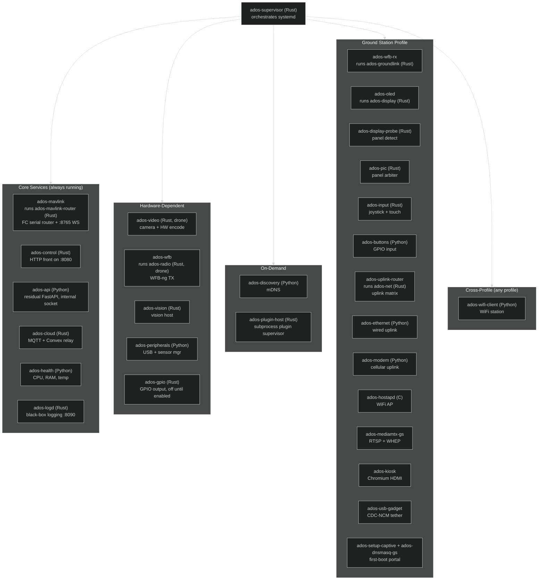

# Agent Services

The ADOS Drone Agent uses a multi-process architecture where each service runs as an independent systemd unit. A supervisor service manages the lifecycle. Services communicate through Unix domain sockets and share no memory.

The agent is a Rust-first hybrid. Most long-running services are native Rust binaries: the supervisor, the MAVLink router, the cloud relay, the video pipeline, the radio data plane, the ground-side receiver, the physical-UI display, the uplink router, the logging daemon, and the vision host. Port 8080 is owned by the native Rust front, `ados-control`, which answers migrated routes directly and reverse-proxies the rest to a residual FastAPI process on an internal Unix socket. Python stays where the ecosystem lives: AI and vision inference, the plugin runtime, the setup webapp, HAL board detection and first-boot bootstrap, the config layer, the health monitor, and some ground-station hardware glue (Ethernet, WiFi client, modem, buttons, peripherals). The supervisor never spawns these processes itself: it issues `systemctl` against a fixed catalog, so systemd remains the process manager and owns the cgroup, restart, and journald wiring. Many unit names are stable shims that exec a Rust binary, so the commands you type (`systemctl restart ados-oled`, `ados-wfb`) keep working while the implementation underneath is native.

## Why multi-process

A single in-process design is simpler, but it has real drawbacks for a drone:

- A crashed video encoder takes down the MAVLink proxy. The flight controller loses its companion link.
- No per-service resource limits. A memory leak in one service starves the others.
- No per-service restart. Fixing a video pipeline issue requires restarting everything.

The multi-process design isolates failures. A crashed `ados-video` gets restarted by systemd in 3 seconds. The MAVLink proxy never notices.

## Service tree



Distributed-receive roles add three more ground-station units when enabled: `ados-batman` (mesh carrier), `ados-wfb-relay` (relay role), and `ados-wfb-receiver` (receiver role).

The supervisor starts child services based on the active profile (air or ground-station) and the hardware detected. Services that depend on hardware not present are masked, not started.

## Systemd unit structure

Each service has a unit file in `/etc/systemd/system/`. Native Rust services run a binary from `/opt/ados/bin/`; the Python-backed units run through the virtual environment in `/opt/ados/venv/`. The unit name stays stable even when the implementation is native: `ados-mavlink` runs `ados-mavlink-router`, `ados-oled` runs `ados-display`, `ados-wfb` runs `ados-radio`, `ados-uplink-router` runs `ados-net`, and `ados-wfb-rx` runs `ados-groundlink`.

```ini
[Unit]
Description=ADOS MAVLink Router
After=ados-supervisor.service
PartOf=ados-supervisor.service

[Service]
Type=simple
User=ados
# The ados-mavlink unit execs the native Rust router binary. Python-backed
# units (for example ados-api, ados-health) use
# /opt/ados/venv/bin/python -m ados.services.<name> instead.
ExecStart=/opt/ados/bin/ados-mavlink-router
Restart=on-failure
RestartSec=3
MemoryMax=128M
CPUQuota=50%

[Install]
WantedBy=ados-supervisor.service
```

Key properties:

- **PartOf:** service stops when the supervisor stops
- **Restart=on-failure:** automatic restart on crash
- **MemoryMax / CPUQuota:** cgroup limits prevent any single service from starving the system

## IPC: Unix domain sockets

Services communicate through two Unix domain sockets in `/run/ados/`:

### MAVLink socket (`/run/ados/mavlink.sock`)

Binary protocol. Each frame is a 4-byte little-endian length prefix followed by raw MAVLink bytes.

```
| LENGTH (4 bytes, LE) | MAVLink v2 frame (LEN bytes) |
```

The MAVLink router writes FC messages to this socket. Other services (cloud, logging, the HTTP front) read from it. This is a publish-subscribe pattern implemented over a Unix socket. Multiple readers get all messages.

Two more sockets round out the IPC surface: `/run/ados/api-internal.sock` (the internal socket the residual FastAPI binds, reached only through the `ados-control` front) and `/run/ados/logd-query.sock` (the on-box query socket for the logging daemon, used by `ados logs query`).

### State socket (`/run/ados/state.sock`)

JSON protocol at 10 Hz. Each frame is a newline-delimited JSON object:

```json
{"ts": 1713270934.5, "mode": "LOITER", "armed": false, "alt": 45.2, "bat": 82, "gps_sats": 12}
```

The health service reads this to compute system metrics. The cloud service reads it for telemetry upload. The OLED service reads it for display rendering.

## Circuit breaker

The supervisor implements a circuit breaker pattern for each service. If a service crashes 5 times within 60 seconds, the breaker opens and the service is not restarted until a manual reset or a supervisor restart.

```
Normal → 5 failures in 60s → Breaker open → Manual reset or supervisor restart → Normal
```

When a breaker opens, the supervisor:

1. Logs a CRITICAL event
2. Sends a notification to Mission Control
3. Continues running all other services

A single bad service does not bring down the whole agent.

## Profile detection

On first boot (or when `agent.profile: auto` is set), the `profile_detect` module runs a score-based hardware fingerprint:

| Signal | Ground score | Air score |
|--------|-------------|-----------|
| I2C OLED at 0x3C or 0x3D | +3 | 0 |
| 4 GPIO buttons with pull-ups | +2 | 0 |
| RTL8812EU USB device | +1 | +1 |
| MAVLink serial device (ttyACM or UART) | 0 | +3 |
| GPS serial device | 0 | +2 |
| FC heartbeat received within 10 seconds | 0 | +3 |
| Known FC carrier board profile | 0 | +2 |

**Decision rules:**
- Ground score `>= 4` AND air score `<= 2`: **ground-station** profile
- Air score `>= 4` AND ground score `<= 2`: **air** profile
- Ambiguous: **unconfigured**, show pick-profile UI

The result is written to `/etc/ados/profile.conf` with the full fingerprint snapshot. Explicit `agent.profile:` in config.yaml always overrides detection.

## Service lifecycle per profile

<Tabs>
  <Tab title="Air profile">
    Always started:
    - `ados-supervisor`, `ados-mavlink`, `ados-control`, `ados-api`, `ados-cloud`, `ados-health`, `ados-logd`

    Hardware-dependent:
    - `ados-video` (if camera detected)
    - `ados-wfb` in TX mode (if RTL8812EU detected)
    - `ados-vision` (if the vision engine is provisioned)
    - `ados-peripherals` (if USB sensors detected)
    - `ados-gpio` (off until enabled, for a status buzzer or LED)

    On-demand:
    - `ados-discovery`, `ados-plugin-host`

    Masked (never started):
    - All ground-station services (hostapd, oled, buttons, kiosk, etc.)
  </Tab>
  <Tab title="Ground station profile">
    Always started:
    - `ados-supervisor`, `ados-control`, `ados-api`, `ados-cloud`, `ados-health`, `ados-logd`
    - `ados-hostapd`, `ados-oled`, `ados-buttons`
    - `ados-wfb-rx` (in the `direct` role)
    - `ados-mediamtx-gs`
    - `ados-uplink-router` (uplink matrix), `ados-pic` (front-panel arbiter)
    - `ados-display-probe` (panel detect)
    - `ados-setup-captive`, `ados-dnsmasq-gs` (first boot)

    Hardware-dependent:
    - `ados-kiosk` (if HDMI output detected)
    - `ados-input` (if a joystick or touch device is present)
    - `ados-ethernet` (if a wired link is present)
    - `ados-wifi-client` (cross-profile; if joining a WiFi network)
    - `ados-usb-gadget` (if USB gadget enabled in config)
    - `ados-modem` (if 4G modem detected and enabled)
    - `ados-batman`, `ados-wfb-relay`, `ados-wfb-receiver` (mesh roles only)

    Masked (never started):
    - `ados-mavlink` (no FC), `ados-video` (no camera), `ados-wfb` TX mode
  </Tab>
</Tabs>

The `ados-cloud` unit is a single cross-profile service. On the ground-station profile it also runs the cloud-relay bridge that forwards a drone's telemetry and video signaling on to the cloud, so there is no separate relay unit.

## HTTP control surface

Port 8080 is served by the native Rust front, `ados-control`. It answers migrated routes directly and reverse-proxies everything else to the residual FastAPI process (the `ados-api` unit) over an internal Unix socket at `/run/ados/api-internal.sock`. From a client's point of view there is one HTTP surface on `:8080`. The split is internal, and the request paths, response bodies, and schemas stay the same across the boundary.

The surface provides:

- `/api/status` and `/api/status/full` for agent state
- `/api/video/*` for video pipeline status and MediaMTX integration
- `/api/v1/ground-station/*` for ground-station-specific endpoints (WiFi, pairing, OLED, buttons, uplinks)
- `/api/command` for drone commands (arm, disarm, mode change)
- `/api/config` for reading and writing agent configuration

Authentication uses the `X-ADOS-Key` header with a key stored in `/etc/ados/config.yaml`, generated at install time. The MAVLink WebSocket on `:8765` (served by `ados-mavlink-router`) uses a short-lived HMAC ticket instead.

The residual FastAPI keeps the features that stay in Python: AI and vision endpoints, the plugin runtime surface, the setup webapp, the device-discovery and peripherals routes, and the WHEP video bridge. As more routes move to the Rust front, the FastAPI footprint shrinks toward those Python-bound features only.

## HAL board profiles

Each supported SBC has a YAML profile in `src/ados/hal/boards/`. The profile defines the SoC, the UART and GPIO map, the video codec support, and the navigation hardware:

```yaml
# Example: rpi4b.yaml
name: "Raspberry Pi 4B"
vendor: "Raspberry Pi"
soc: "BCM2711"
arch: "aarch64"
model_patterns:
  - "Raspberry Pi 4 Model B"
default_tier: 3
uart_paths:
  - /dev/ttyAMA0
  - /dev/ttyS0
gpio_pins: [2, 3, 14, 15, 18]
hw_video_codecs:
  - h264_enc
  - h264_dec
  - h265_dec
video:
  csi_ports: 1
  max_encode_resolution: "1920x1080"
  max_encode_fps: 30
  encoder_api: v4l2
buses:
  i2c:
    - id: i2c1
```

The profile drives service startup, GPIO mapping, video encoder selection, and feature gating. Detection runs on `/proc/device-tree/model`, `/proc/cpuinfo`, and an optional `/etc/ados/board_override`. Unknown boards fall back to safe `generic-arm64` defaults.

## Resource budget

Memory use is dominated by the Python residual (FastAPI), the video encoder buffers, and Chromium when the HDMI kiosk runs. The native Rust services are lean: each orchestrator sits in the tens of MB. Indicative figures for the ground-station profile on a Pi 4B (4 GB RAM):

| Service | Typical RAM |
|---------|-------------|
| ados-supervisor (Rust) | ~15 MB |
| ados-control (Rust front) | ~15 MB |
| ados-api (FastAPI, internal socket) | ~40 MB |
| ados-wfb-rx (Rust) | ~20 MB |
| ados-mediamtx-gs | ~30 MB |
| ados-hostapd | ~5 MB |
| ados-oled (Rust) | ~10 MB |
| ados-buttons (Python) | ~5 MB |
| ados-health (Python) | ~10 MB |
| ados-kiosk (Chromium) | 280-520 MB |
| **Total (no kiosk)** | **~155 MB** |
| **Total (with kiosk 720p)** | **~435 MB** |

On a 4 GB Pi 4B this leaves multiple GB free with or without the kiosk. A lean flight node can run a zero-Python core (the MAVLink router, camera encode, radio, and the `ados-control` front) for a much smaller footprint.

## What is next

- [Video Stack](/architecture/video-stack) for the camera-to-browser pipeline
- [Cloud Infrastructure](/architecture/cloud-infrastructure) for the three relay layers
- [Project Structure](/architecture/project-structure) for the codebase layout
