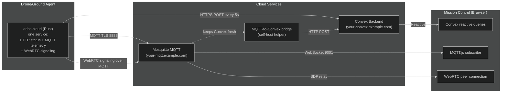

# Cloud Infrastructure

The cloud layer is optional. Every core ADOS function works without internet. But when you want remote monitoring, fleet management, or observer access from across the internet, three relay layers provide increasing levels of real-time capability.

## Three layers



On the agent, all three layers are the work of one native Rust service, `ados-cloud`: it POSTs status to Convex, publishes telemetry to MQTT, and handles WebRTC signaling over MQTT. The agent reaches Convex directly, so the cloud-side MQTT-to-Convex bridge is an optional helper that keeps Convex fresh from the higher-rate MQTT stream, not a required hop.

## Layer 1: Convex HTTP (baseline)

The simplest relay. The agent's native Rust cloud service (`ados-cloud`) POSTs a JSON status payload to the Convex backend every 5 seconds. Mission Control uses Convex's reactive queries to display the data in real time.

| Detail | Value |
|--------|-------|
| Endpoint | Convex site origin `/agent/status` (`:3211`; managed by Altnautica in cloud mode, or `your-convex.example.com:3211` self-hosted) |
| Frequency | Every 5 seconds |
| Payload | JSON: mode, armed, battery, GPS, altitude, speed, connection state |
| Bandwidth | Under 1 Kbps |
| Latency | 5-10 seconds (poll interval) |

This layer requires only outbound HTTPS from the agent. No port forwarding, no MQTT, no special setup. If the agent can reach the internet, status shows up in the GCS.

### Convex tables

Two custom tables power the cloud relay:

- **`cmd_droneStatus`**: Stores the latest status for each device. Upserted on every POST. Reactive query in the browser delivers changes immediately.
- **`cmd_droneCommands`**: Command queue. Mission Control enqueues commands (arm, disarm, mode change). The agent polls this table and ACKs each command after execution.

## Layer 2: MQTT (real-time telemetry)

For higher-frequency data, the agent publishes to MQTT topics via a Mosquitto broker behind a Cloudflare Tunnel. Mission Control subscribes from the browser using MQTT.js over WebSocket.

| Detail | Value |
|--------|-------|
| Broker | `your-mqtt.example.com` (WebSocket on port 443, Cloudflare Tunnel; managed by Altnautica in cloud mode) |
| Topics | `ados/{deviceId}/status`, `ados/{deviceId}/telemetry` |
| Frequency | 2 Hz (configurable) |
| Payload | JSON telemetry (attitude, GPS, battery, sensors) |
| Bandwidth | 5-15 Kbps |
| Latency | 100-300 ms |
| Auth | Username `ados`, hashed password |

The MQTT-to-Convex bridge runs alongside the broker. It subscribes to all `ados/+/status` and `ados/+/telemetry` topics, debounces 3 seconds per device, and POSTs the latest data to Convex. This keeps the Convex tables fresh for clients that use reactive queries instead of direct MQTT.

### Why MQTT, not just Convex polling

Convex reactive queries are great for UI updates but the minimum granularity is tied to the 5-second HTTP POST cycle. MQTT gives true 2 Hz telemetry with ~200 ms latency. For a remote operator watching a live mission, the difference between 5-second updates and 500 ms updates is significant.

MQTT also handles unreliable connections better. QoS 1 ensures delivery even if the TCP connection momentarily drops.

## Layer 3: WebRTC video (peer-to-peer)

Live video does not go through a cloud media server. Instead, the browser and agent establish a direct WebRTC peer-to-peer connection. The MQTT broker acts as the signaling relay.

The signaling flow:

1. Browser publishes an SDP offer to `ados/{deviceId}/webrtc/offer`
2. The agent's `ados-cloud` service receives the offer via MQTT
3. Agent creates a WebRTC answer using the local MediaMTX WHEP endpoint
4. Agent publishes the SDP answer to `ados/{deviceId}/webrtc/answer`
5. Browser receives the answer, ICE candidates are exchanged
6. WebRTC media stream flows directly between browser and agent (peer-to-peer)

Once the peer connection is established, video flows directly between the two peers. The MQTT broker is only involved during the signaling handshake, not during streaming.

<Note>
P2P WebRTC requires both sides to be able to reach each other after STUN-negotiated NAT traversal. About 85-90% of networks support this. The remaining 10-15% (symmetric NAT on some cellular carriers) need a TURN relay, which is not yet deployed. Those users see a clear error in the transport switcher.
</Note>

## Infrastructure layout

All cloud services are co-located on a single Linux server:

| Service | Port | Access |
|---------|------|--------|
| Convex backend (client API) | 3210 | Used by the GCS browser client (`NEXT_PUBLIC_CONVEX_URL`) |
| Convex backend (site / HTTP actions) | 3211 | Used by the agent heartbeat and the MQTT bridge (`/agent/status`) |
| Mosquitto MQTT | 1883 (TCP), 9001 (WebSocket) | `your-mqtt.example.com` via Cloudflare Tunnel |
| MQTT-to-Convex bridge | Internal | Subscribes to Mosquitto, POSTs to the Convex site origin (`:3211`) |

Everything routes through Cloudflare Tunnels. No inbound ports are open on the server. The Tunnel client (`cloudflared`) maintains outbound connections to Cloudflare's edge.

## Self-hosting

You can run the entire cloud stack on your own hardware using Docker Compose.

### Convex backend

```bash
git clone https://github.com/altnautica/ADOSMissionControl
cd ADOSMissionControl
npx convex dev  # Starts a local Convex dev server
```

Or deploy to Convex cloud (free tier available) and point your agent at it.

### MQTT broker + bridge

The MQTT broker and bridge are in `ADOSMissionControl/tools/mqtt-bridge/`:

```bash
cd tools/mqtt-bridge
docker compose up -d
```

This starts Mosquitto with WebSocket support and the MQTT-to-Convex bridge. Edit `.env` to point the bridge at your Convex deployment.

### Agent configuration

Point your agent at your own cloud. The agent reads its cloud posture from `server.mode` and a matching block. For a self-hosted backend, set `mode: self_hosted` and fill in `server.self_hosted`:

```yaml
# /etc/ados/config.yaml
server:
  mode: self_hosted          # local | cloud | self_hosted
  self_hosted:
    url: "https://your-convex.example.com:3211"   # Convex SITE origin (HTTP actions)
    mqtt_broker: "your-mqtt.example.com"
    mqtt_port: 8883
    api_key: ""              # if your broker requires one
pairing:
  convex_url: "https://your-convex.example.com:3211"   # Convex SITE origin (HTTP actions)
```

<Warning>
Set BOTH `server.self_hosted.url` AND `pairing.convex_url` to your Convex **site** origin (the HTTP-actions origin, port `:3211` on a self-hosted backend), not the client-API origin (`:3210`). The status heartbeat resolves its URL from `pairing.convex_url`, while the Python pairing register reads `server.self_hosted.url`. If only one is set, the agent can pair but never beacon (or beacon but never register), and the drone never appears in Mission Control. The agent falls back from one to the other when a value is missing, but setting both explicitly is the safest configuration.
</Warning>

The full set of `server` keys (defaults shown):

| Key | Default | Purpose |
|-----|---------|---------|
| `server.mode` | `local` | `local` disables the cloud relay; `cloud` uses the Altnautica-managed backend (zero config, no endpoints to set); `self_hosted` points at your own deployment |
| `server.self_hosted.url` | `""` | Convex site origin for status POSTs (self-hosted mode) |
| `server.self_hosted.mqtt_broker` | `""` | Your MQTT broker host |
| `server.self_hosted.mqtt_port` | `8883` | MQTT port (TLS) |
| `server.self_hosted.api_key` | `""` | Optional broker credential |
| `server.mqtt_transport` | `websockets` | `tcp` or `websockets` |
| `server.mqtt_username` | `ados` | MQTT username |
| `pairing.convex_url` | managed site origin | Convex site origin the heartbeat POSTs to |

There is no `cloud:` top-level section. Keys like `convex_url` or `mqtt_ws_url` do not exist; use the schema above.

## Cloudflare Tunnel setup

If you want to expose your self-hosted services without port forwarding:

<Steps>
  <Step title="Install cloudflared">
    ```bash
    curl -L https://pkg.cloudflare.com/cloudflare-main.gpg | sudo tee /usr/share/keyrings/cloudflare.gpg
    echo "deb [signed-by=/usr/share/keyrings/cloudflare.gpg] https://pkg.cloudflare.com/cloudflared $(lsb_release -cs) main" | sudo tee /etc/apt/sources.list.d/cloudflared.list
    sudo apt update && sudo apt install cloudflared
    ```
  </Step>
  <Step title="Create a tunnel">
    ```bash
    cloudflared tunnel login
    cloudflared tunnel create ados-relay
    ```
  </Step>
  <Step title="Configure hostname routing">
    Create `~/.cloudflared/config.yml`:

    ```yaml
    tunnel: YOUR_TUNNEL_ID
    credentials-file: /root/.cloudflared/YOUR_TUNNEL_ID.json
    ingress:
      - hostname: convex.yourdomain.com
        service: http://localhost:3210
      - hostname: mqtt.yourdomain.com
        service: http://localhost:9001
      - service: http_status:404
    ```
  </Step>
  <Step title="Start the tunnel">
    ```bash
    cloudflared tunnel run ados-relay
    ```
  </Step>
</Steps>

## Bandwidth and cost

| Component | Bandwidth | Monthly cost |
|-----------|-----------|-------------|
| Convex (self-hosted) | Under 1 GB/month | Free (your hardware) |
| Convex (cloud free tier) | Under 1 GB/month | Free |
| MQTT telemetry | ~100-500 MB/month per drone | Free (self-hosted) |
| Cloudflare Tunnel | Unlimited | Free tier |
| STUN (Google/Cloudflare) | Negligible | Free |
| Video (P2P WebRTC) | 0 server cost (peer-to-peer) | Free |

The entire cloud relay stack can run at zero monthly cost for small deployments.

## What is next

- [Video Stack](/architecture/video-stack) for the full video pipeline details
- [System Overview](/architecture/system-overview) for the three-tier architecture
- [Project Structure](/architecture/project-structure) for where cloud code lives
