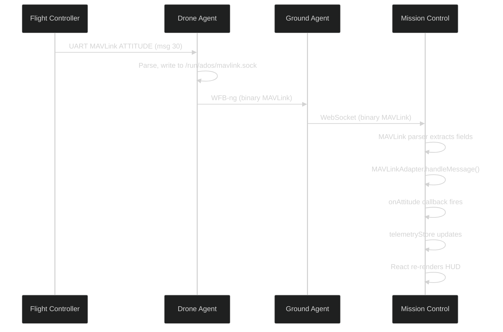

# MAVLink Protocol Layer

ADOS Mission Control talks to flight controllers using the MAVLink v2 protocol (for ArduPilot and PX4) and the MSP protocol (for Betaflight). A `DroneProtocol` TypeScript interface abstracts the differences so the rest of the app does not care which firmware is on the other end.

## MAVLink v2 basics

MAVLink v2 is a binary protocol. Each message has a fixed structure:

```
| STX (0xFD) | LEN | INC | CMP | SEQ | SYS | COMP | MSG_ID (3 bytes) | PAYLOAD | CRC-16 |
```

- **STX** is always `0xFD` for v2 (v1 uses `0xFE`)
- **LEN** is the payload length in bytes
- **MSG_ID** is 3 bytes (v2 supports up to 16 million message types, v1 only 256)
- **CRC-16** uses the X.25 algorithm with a per-message **CRC_EXTRA** byte

### CRC_EXTRA

Every MAVLink message definition has a CRC_EXTRA constant that acts as a schema version check. The transmitter and receiver must agree on the message layout. If a message was redefined (fields added or reordered), the CRC_EXTRA changes and the receiver rejects the packet.

ADOS Mission Control ships CRC_EXTRA values for all 83 decoded message types. These are defined in `src/lib/protocol/mavlink-constants.ts` alongside the expected payload lengths.

## Parser architecture

The MAVLink parser is a streaming state machine in `src/lib/protocol/mavlink-parser.ts`. It processes raw bytes from the WebSocket or WebSerial connection:

```
Bytes in -> Find STX -> Read header -> Read payload -> Verify CRC -> Emit message
```

The parser handles:

- **Interleaved v1 and v2 packets** on the same stream
- **Partial reads** (bytes arrive in arbitrary chunks over WebSocket)
- **Zero-copy parsing** for performance-critical paths (attitude, GPS, battery messages arrive at 10-50 Hz)

## The DroneProtocol interface

`DroneProtocol` is the TypeScript interface that every protocol adapter must implement. It defines about 50 methods covering connection lifecycle, parameter management, telemetry callbacks, and command execution.

Key method groups:

```typescript
interface DroneProtocol {
  // Connection
  connect(transport: Transport): Promise<void>
  disconnect(): void

  // Parameters
  getParameter(name: string): Promise<ParamValue>
  setParameter(name: string, value: number): Promise<SetParamResult>
  commitParamsToFlash(): void

  // Commands
  sendCommand(cmd: number, params: number[]): Promise<CommandResult>
  arm(): Promise<CommandResult>
  disarm(): Promise<CommandResult>
  setMode(mode: number): Promise<CommandResult>
  takeoff(altitude: number): Promise<CommandResult>

  // Telemetry callbacks
  onAttitude(cb: (msg: AttitudeMsg) => void): Unsubscribe
  onGps(cb: (msg: GpsMsg) => void): Unsubscribe
  onBattery(cb: (msg: BatteryMsg) => void): Unsubscribe
  onHeartbeat(cb: (msg: HeartbeatMsg) => void): Unsubscribe
  // ... ~46 more callbacks

  // Capabilities
  capabilities: ProtocolCapabilities
}
```

The `ProtocolCapabilities` type tells the UI which features are available:

```typescript
type ProtocolCapabilities = {
  supportsParams: boolean
  supportsParamExtended: boolean
  supportsMission: boolean
  supportsCalibration: boolean
  supportsVtol: boolean
  supportsFirmwareFlash: boolean
  supportsOsd: boolean
  // ... more
}
```

Configure panels in the UI check capabilities before rendering. A Betaflight-connected drone does not see the MAVLink-only failsafe panel.

## MAVLink adapter

`MAVLinkAdapter` implements `DroneProtocol` for ArduPilot and PX4. It contains:

- **83 message decoders** in the `handleMessage()` switch statement, each pulling typed fields from the binary payload
- **33 MAV_CMD handlers** for arm, disarm, takeoff, land, set mode, calibrate, RTL, waypoint commands, VTOL transition, ROI targeting, and more
- **Parameter protocol** with `PARAM_REQUEST_LIST`, `PARAM_SET`, and `PARAM_VALUE` message handling. ArduPilot auto-saves parameters to EEPROM on `PARAM_SET`, so `commitParamsToFlash()` is fire-and-forget
- **Mission protocol** with `MISSION_REQUEST_LIST`, `MISSION_ITEM_INT`, `MISSION_COUNT`, and `MISSION_ACK` for uploading waypoints

### Firmware-specific behavior

ArduPilot and PX4 share the MAVLink protocol but differ in parameter names, mode numbers, and some command semantics. The adapter handles this through a `firmware` field set during heartbeat detection:

- **ArduPilot:** 200+ mapped parameters, 18 flight modes, 9 calibration types
- **PX4:** 63+ mapped parameters, 18 flight modes, 3 PX4-specific panels (Airframe, Actuator, MavlinkShell)

## MSP adapter (Betaflight)

`MSPAdapter` implements `DroneProtocol` for Betaflight and iNav. MSP (MultiWii Serial Protocol) is fundamentally different from MAVLink:

- Binary with MSPv1 and MSPv2 framing
- CRC-8 DVB-S2 for v2 (XOR checksum for v1)
- One message in flight at a time (serial queue)
- No parameter names, only numeric configuration blocks

The MSP implementation includes:

- **34 message decoders** for status, attitude, GPS, battery, motor output, PID, rates, OSD, VTX, and more
- **21 message encoders** for setting PIDs, rates, OSD layout, VTX config, and serial ports
- **~105 virtual parameters** that map MSP configuration blocks to the `usePanelParams` hook interface, so existing configure panels work with Betaflight without code changes
- **19-state streaming parser** handling MSPv1, MSPv2, and jumbo frames

### Virtual parameters

Betaflight does not have a parameter-value store like ArduPilot. Instead, it has binary configuration blocks (PID profile, rate profile, mixer config, etc.). The MSP adapter maps these blocks to virtual parameter names like `BF_PID_ROLL_P`, `BF_RATE_RC_EXPO`, and `BF_OSD_ITEM_0_POS`.

This lets the `usePanelParams` hook (which powers every configure panel) work identically with MAVLink and MSP connections. Panel code never touches protocol details.

## Encoder architecture

MAVLink message encoding is split across six modules under `src/lib/protocol/encoders/`:

| Module | Purpose |
|--------|---------|
| `core.ts` | Heartbeat, system status, statustext |
| `params.ts` | PARAM_SET, PARAM_REQUEST_LIST, PARAM_REQUEST_READ |
| `control.ts` | MANUAL_CONTROL (50 Hz stick input), SET_MODE |
| `mission.ts` | MISSION_COUNT, MISSION_ITEM_INT, MISSION_REQUEST_LIST, MISSION_ACK |
| `frame.ts` | MAVLink v2 frame builder (header + CRC-16 with CRC_EXTRA) |
| `peripheral.ts` | MAV_CMD_PREFLIGHT_CALIBRATION, MAV_CMD_DO_SET_SERVO, gimbal commands |

The barrel file `mavlink-encoder.ts` re-exports everything for convenience.

## Transport layer

The protocol adapters do not care how bytes arrive. A `Transport` abstraction handles the connection:

| Transport | Use case |
|-----------|----------|
| WebSocket | Remote connection to drone agent or ground station. Default for LAN and cloud |
| WebSerial | Direct USB connection to a flight controller from the browser. Used for configuration and firmware flashing |
| SITL TCP-to-WS bridge | ArduPilot SITL simulator for development. The bundled `tools/sitl/` bridges TCP to WebSocket |
| Mock | Demo mode. Generates synthetic telemetry from 5 simulated drones |

## Message flow example

A typical telemetry flow from flight controller to browser:



## Adding a new decoder

To add support for a new MAVLink message:

1. Add the message ID, CRC_EXTRA, and payload length to `mavlink-constants.ts`
2. Add a `case` in `MAVLinkAdapter.handleMessage()` that decodes the payload bytes
3. Add a callback method to `DroneProtocol` (e.g., `onNewMessage`)
4. Subscribe to the callback in `DroneManager.bridgeTelemetry()`
5. Update the relevant Zustand store with the decoded data

See [Contributing Guide](/architecture/contributing-guide) for a detailed walkthrough.

## What is next

- [State Management](/architecture/state-management) for how telemetry reaches the UI
- [Agent Services](/architecture/agent-services) for the server-side MAVLink proxy
- [Video Stack](/architecture/video-stack) for the video pipeline
