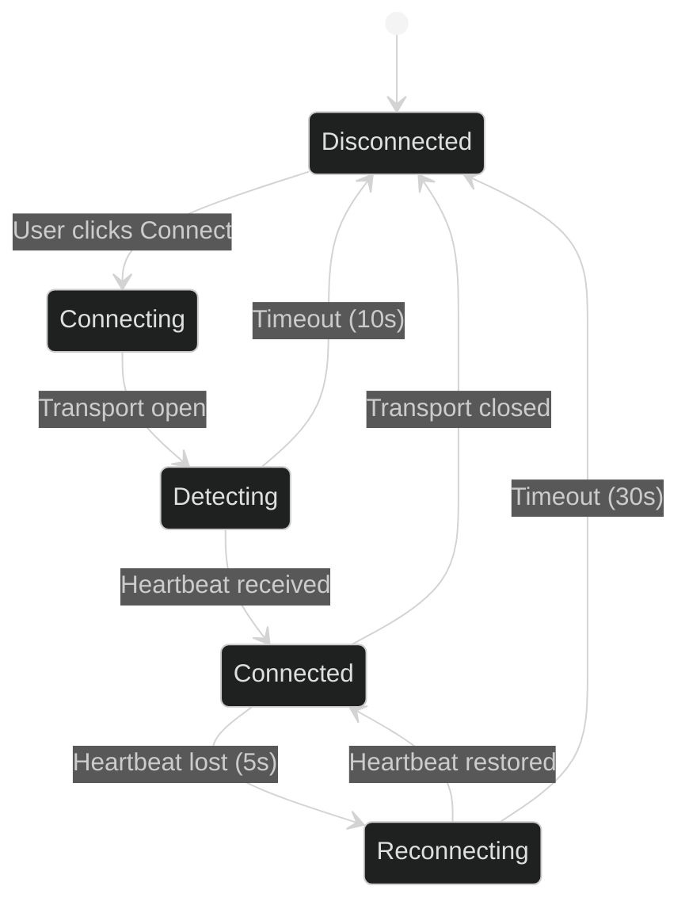

# State Management

ADOS Mission Control uses Zustand for all client-side state. There are 54 stores covering telemetry, drone management, mission planning, video, settings, and more. Each store is a small, focused slice of state with its own actions and selectors.

## Why Zustand

Zustand is a minimal state manager for React. It has no boilerplate, no context providers, and no reducers. A store is a plain function that returns state and actions. Components subscribe to specific fields and only re-render when those fields change.

This matters for a GCS because telemetry arrives at 10-50 Hz. A full React context re-render at 50 Hz would freeze the browser. Zustand's fine-grained subscriptions keep the frame rate stable even under heavy telemetry load.

## Store categories

The 54 stores group into six categories:

| Category | Stores | Examples |
|----------|--------|---------|
| Telemetry | 8 | `telemetry-store`, `battery-store`, `gps-store`, `attitude-store`, `sensor-store`, `rc-channels-store`, `servo-output-store`, `esc-store` |
| Drone management | 5 | `drone-manager`, `protocol-store`, `connection-store`, `demo-store`, `fleet-store` |
| Mission planning | 7 | `planner-store`, `drawing-store`, `pattern-store`, `geofence-store`, `rally-store`, `plan-library-store`, `simulation-history-store` |
| Configuration | 6 | `parameter-store`, `calibration-store`, `firmware-store`, `osd-store`, `failsafe-store`, `ports-store` |
| Video and comms | 5 | `video-store`, `ground-station-store`, `cloud-status-store`, `mqtt-store`, `traffic-store` |
| UI and settings | 23 | `settings-store`, `theme-store`, `notifications-store`, `layout-store`, `sidebar-store`, and 18 more |

## Ring buffers for telemetry

High-frequency telemetry stores use ring buffers instead of growing arrays. A ring buffer holds a fixed number of samples (typically 300) and overwrites the oldest when full. This keeps memory bounded regardless of flight duration.

```typescript
// Simplified ring buffer pattern used in telemetry stores
interface RingBuffer<T> {
  data: T[]
  head: number
  capacity: number
}

function push<T>(buffer: RingBuffer<T>, item: T) {
  buffer.data[buffer.head] = item
  buffer.head = (buffer.head + 1) % buffer.capacity
}
```

Stores that use ring buffers:

| Store | Buffer size | Update rate | Purpose |
|-------|------------|-------------|---------|
| `telemetry-store` | 300 | 10 Hz | Attitude, altitude, speed history for charts |
| `battery-store` | 300 | 2 Hz | Voltage and current history |
| `gps-store` | 300 | 5 Hz | Position history for trail rendering |
| `rc-channels-store` | 60 | 10 Hz | RC input history for the stick visualizer |

## The drone manager bridge

`DroneManager` is the central coordinator between protocol adapters and stores. When a connection is established, `bridgeTelemetry()` subscribes to all protocol callbacks and routes the data to the correct stores:

```typescript
// Simplified from drone-manager.ts bridgeTelemetry()
function bridgeTelemetry(protocol: DroneProtocol) {
  protocol.onHeartbeat((msg) => {
    connectionStore.setHeartbeat(msg)
    droneManagerStore.setMode(msg.customMode)
  })

  protocol.onAttitude((msg) => {
    telemetryStore.pushAttitude(msg)
    attitudeStore.set(msg)
  })

  protocol.onGps((msg) => {
    gpsStore.set(msg)
    telemetryStore.pushPosition(msg)
  })

  protocol.onBattery((msg) => {
    batteryStore.set(msg)
    telemetryStore.pushBattery(msg)
  })

  // ... 26 core callbacks + 15 optional capability-gated callbacks
}
```

The bridge subscribes to 26 core callbacks that every protocol supports, plus up to 15 optional callbacks gated by `protocol.capabilities`. For example, `onGimbalManagerStatus` only subscribes if `capabilities.supportsGimbalV2` is true.

Each subscription returns an unsubscribe function. When the connection closes, all subscriptions are cleaned up.

## Parameter store

The parameter store holds the flight controller's full parameter set (1,000+ parameters for ArduPilot). It supports:

- **Batch loading** via `PARAM_REQUEST_LIST` (receives all parameters over 5-15 seconds)
- **Individual reads** via `PARAM_REQUEST_READ`
- **Writes** via `PARAM_SET` with optimistic UI update and rollback on failure
- **Search and filtering** by parameter name, group, or description

The `usePanelParams` hook is the primary interface for configure panels:

```typescript
function usePanelParams(paramNames: string[]) {
  // Returns { values, setParam, isLoading, isDirty }
  // Automatically subscribes to the parameter store
  // Handles both MAVLink native params and MSP virtual params
}
```

Every configure panel (failsafe, PID tuning, power, OSD, ports, etc.) uses this hook. Panel code never touches protocol details directly.

## Demo mode and the mock engine

Demo mode runs five simulated drones with realistic telemetry. The mock engine generates synthetic MAVLink messages:

- Attitude oscillates with configurable rates
- GPS follows circular or waypoint paths
- Battery drains over time
- Mode transitions happen on a timer

The mock engine implements the `DroneProtocol` interface, so the rest of the app cannot tell the difference between a real drone and a simulated one. This is useful for development, demos, and testing UI without hardware.

Demo mode activates from the welcome modal or the settings page. It runs entirely in the browser with no backend.

## Connection lifecycle



The `connection-store` tracks this state machine. UI components subscribe to the connection state to show appropriate indicators (green dot, yellow reconnecting, red disconnected).

## Persist and hydration

Some stores persist to IndexedDB via Zustand's `persist` middleware:

| Store | What persists | Version |
|-------|--------------|---------|
| `settings-store` | Video transport mode, theme, units, language, recent connections | 31 |
| `plan-library-store` | Saved mission plans | 3 |
| `simulation-history-store` | Past simulation results | 2 |
| `layout-store` | Panel sizes, sidebar state | 4 |

Each persisted store has a version number. When the schema changes, a migration function converts the old format to the new one. The version is bumped in the same commit that changes the schema.

Stores that hold ephemeral telemetry (attitude, GPS, battery) never persist. They reset to defaults on page load.

## Selectors and performance

Components use Zustand selectors to subscribe to specific fields:

```typescript
// Good: only re-renders when altitude changes
const altitude = useTelemetryStore((s) => s.altitude)

// Bad: re-renders on ANY store change
const everything = useTelemetryStore()
```

For computed values that depend on multiple fields, `useShallow` prevents unnecessary re-renders:

```typescript
const { lat, lng, alt } = useGpsStore(
  useShallow((s) => ({ lat: s.lat, lng: s.lng, alt: s.alt }))
)
```

## Notifications

The `notifications-store` handles transient alerts (arm/disarm, mode changes, failsafe triggers, parameter save confirmations). Notifications auto-dismiss after 5 seconds. Critical notifications (failsafe, low battery) stay until acknowledged.

The store caps at 50 notifications and drops the oldest when full.

## What is next

- [MAVLink Protocol](/architecture/mavlink-protocol) for the protocol adapter layer
- [Agent Services](/architecture/agent-services) for the server-side state
- [Project Structure](/architecture/project-structure) for where stores live in the codebase
