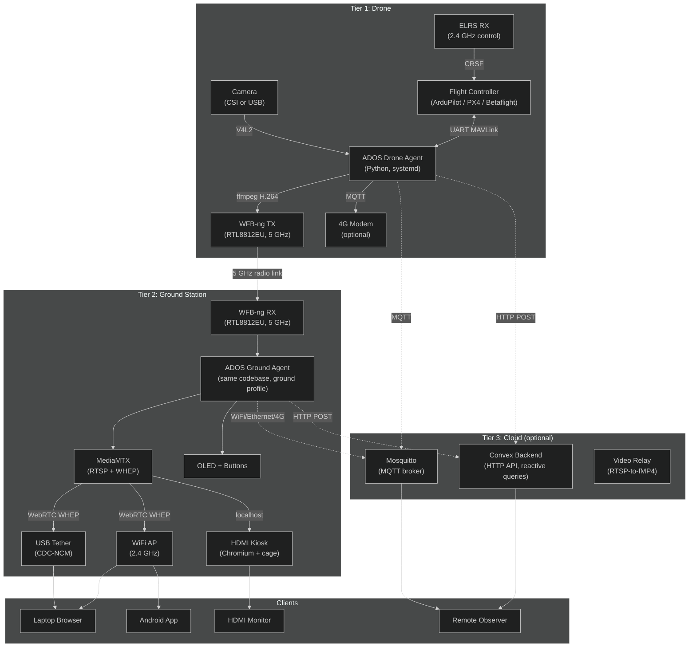

# System Overview

ADOS is a three-tier system: a drone agent on the aircraft, a ground agent on a nearby SBC, and optional cloud services for remote access. Each tier is independent. You can fly with just the first two and no internet at all.

## The three tiers

## Deployment models

ADOS supports three deployment models depending on what you need.

### Field mode (Tier 1 + Tier 2)

The drone and ground station communicate directly over WFB-ng radio. No internet. No cloud. Latency is 50-100 ms glass-to-glass. This is the default for field operations.

### Cloud mode (Tier 1 + Tier 3)

The drone has its own 4G modem and pushes telemetry and video to the cloud. A remote operator uses Mission Control at `command.altnautica.com` to monitor or control. Latency is 200-500 ms. No ground station needed, but you lose the low-latency WFB-ng path.

### Hybrid mode (Tier 1 + Tier 2 + Tier 3)

The ground station receives WFB-ng for local low-latency flight, and simultaneously bridges telemetry to the cloud for remote observers. This is the best-of-both-worlds setup for commercial operations.

## Protocol stack

Each connection between components uses a specific protocol:

| Connection | Protocol | Format | Typical rate |
|-----------|----------|--------|-------------|
| FC to Agent | UART MAVLink v2 | Binary, CRC-16 | 10-50 Hz per message |
| Agent IPC (MAVLink) | Unix socket `/run/ados/mavlink.sock` | 4-byte length prefix + binary | All FC messages |
| Agent IPC (state) | Unix socket `/run/ados/state.sock` | JSON | 10 Hz |
| Agent to WFB-ng | Pipe to `wfb_tx` | Raw H.264 NAL units | 4-8 Mbps |
| WFB-ng air to ground | 5 GHz monitor mode (IEEE 802.11) | FEC-encoded packets | 4-8 Mbps |
| Ground to browser (video) | WebRTC WHEP | H.264 RTP | 4-8 Mbps |
| Ground to browser (telemetry) | WebSocket | JSON MAVLink | 10-30 Kbps |
| Agent to cloud (status) | HTTPS POST to Convex | JSON | Every 5 s |
| Agent to cloud (telemetry) | MQTT (TLS) | JSON | 2 Hz |
| Agent to cloud (video) | WebRTC P2P via MQTT signaling | H.264 RTP | 4-8 Mbps |

## Two repos, one system

The entire ADOS stack lives in two public repositories:

| Repository | Language | Purpose |
|-----------|----------|---------|
| [altnautica/ADOSMissionControl](https://github.com/altnautica/ADOSMissionControl) | TypeScript (Next.js 16, React 19) | Ground control station, web app |
| [altnautica/ADOSDroneAgent](https://github.com/altnautica/ADOSDroneAgent) | Python 3.11+ | Drone agent and ground agent |

Both are GPLv3. The agent runs on the drone and the ground station (same code, different profile). Mission Control runs in a browser and talks to both.

## Key architectural decisions

**Multi-process over single-process.** The drone agent runs each service (MAVLink, video, cloud, health) as a separate systemd unit with its own cgroup resource limits. A crashed video encoder does not take down the MAVLink proxy. See [Agent Services](/architecture/agent-services).

**Web over native.** Mission Control is a browser app, not a desktop application. WebSerial for FC communication, WebRTC for video, Web Gamepad API for flight controls. Electron wraps it for desktop distribution with full Chromium capabilities. See [State Management](/architecture/state-management).

**WFB-ng over WiFi.** The radio link uses WFB-ng (WiFi Broadcast next generation), which puts the radio in monitor mode and broadcasts FEC-encoded packets. This is not standard WiFi. There is no association, no handshake, no retransmission. The result is consistent low latency at ranges up to 50 km. See [Video Stack](/architecture/video-stack).

**Profile over fork.** The ground station is not a separate codebase. It is the same ADOS Drone Agent with a different profile selected at boot. This means one install script, one upgrade path, and one test matrix. See [Agent Services](/architecture/agent-services).

## Latency budget

End-to-end latency from camera sensor to browser pixel:

| Stage | Duration |
|-------|----------|
| V4L2 capture | 5-10 ms |
| ffmpeg H.264 encode | 10-20 ms |
| WFB-ng TX + air | 2-5 ms |
| WFB-ng RX + reassembly | 2-5 ms |
| MediaMTX RTSP ingest | 1-2 ms |
| WebRTC WHEP to browser | 10-20 ms |
| Browser decode and render | 10-15 ms |
| **Total (LAN/USB)** | **40-77 ms** |
| **Total (WiFi AP)** | **60-100 ms** |

## What is next

- [MAVLink Protocol](/architecture/mavlink-protocol) for the protocol layer
- [Agent Services](/architecture/agent-services) for the systemd architecture
- [Video Stack](/architecture/video-stack) for the full video pipeline
- [Cloud Infrastructure](/architecture/cloud-infrastructure) for the three relay layers
