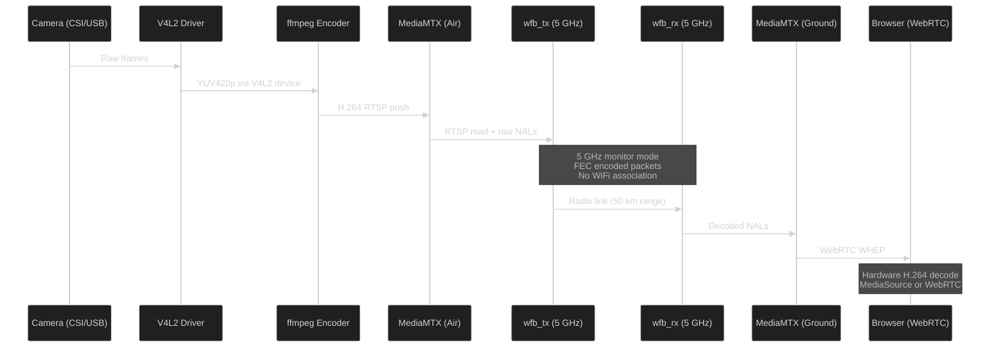

# Video Stack

The ADOS video pipeline carries live HD video from the drone's camera to your browser with 40-100 ms latency, depending on the connection. It uses standard open-source tools at every stage: V4L2 for capture, ffmpeg for encoding, WFB-ng for radio transport, MediaMTX for local serving, and WebRTC for browser delivery.

## Full pipeline



## Stage 1: Capture

The drone agent detects cameras at boot by scanning `/dev/video*` devices. It supports:

- **MIPI CSI cameras** via V4L2 (Radxa Camera 4K, Arducam modules)
- **USB UVC cameras** via V4L2 (any standard webcam)

The camera service runs `v4l2-ctl` to configure resolution, framerate, and pixel format before starting the encoder. Default: 1080p at 30 fps, YUV420p.

On boards with hardware-capable SoCs (RK3588, RK3576), the agent can use `rkmpp` (Rockchip Media Process Platform) for zero-copy encode directly from the camera ISP. On boards without hardware encode (Pi 4B), it falls back to `libx264` via ffmpeg.

## Stage 2: Encode

ffmpeg encodes the raw camera output to H.264:

```bash
ffmpeg \
  -f v4l2 -input_format yuyv422 -video_size 1920x1080 -framerate 30 \
  -fflags nobuffer -flags low_delay \
  -probesize 32 -analyzeduration 0 \
  -i /dev/video0 \
  -c:v libx264 -preset ultrafast -tune zerolatency \
  -profile:v high -level 4.1 \
  -b:v 6000k -maxrate 6000k -bufsize 3000k \
  -g 30 -keyint_min 30 \
  -f rtsp rtsp://localhost:8554/ados
```

Key flags for low latency:

| Flag | Purpose |
|------|---------|
| `-fflags nobuffer` | Disable input buffering |
| `-flags low_delay` | Minimize encoder latency |
| `-probesize 32` | Tiny probe size (faster startup) |
| `-analyzeduration 0` | Skip format analysis |
| `-preset ultrafast -tune zerolatency` | Fastest possible x264 encode |
| `-g 30 -keyint_min 30` | Keyframe every 1 second (30 fps / 30 GOP) |

The encoded stream pushes to a local MediaMTX instance over RTSP.

## Stage 3: WFB-ng transport

WFB-ng (WiFi Broadcast next generation) uses an RTL8812EU adapter in monitor mode to broadcast FEC-encoded packets on 5 GHz. This is not standard WiFi. There is no association, no handshake, no retransmission, and no CSMA/CA backoff.

Key properties:

| Property | Value |
|----------|-------|
| Radio mode | 802.11 monitor mode (injection) |
| Frequency | 5 GHz (channels 36-165) |
| FEC | Reed-Solomon, configurable ratio |
| Encryption | WFB-ng key exchange (AES) |
| Max range | 50+ km (with directional antennas) |
| Typical latency | 2-5 ms one-way |

On the air side, `wfb_tx` reads the RTSP stream from MediaMTX and broadcasts it. On the ground side, `wfb_rx` receives and reassembles the stream, feeding it back into a ground-side MediaMTX instance.

The agent manages `wfb_tx` and `wfb_rx` as systemd services. It does not use OpenHD as a runtime dependency. WFB-ng is the transport protocol, and the agent controls it directly.

## Stage 4: Ground serving

The ground-side MediaMTX instance ingests the reassembled stream from WFB-ng RX and serves it to clients over WebRTC WHEP (Web Hosted Exchange Protocol).

WHEP is an HTTP-based WebRTC signaling protocol. The browser sends a POST to the WHEP endpoint, and MediaMTX responds with an SDP answer. No custom signaling server needed.

| Endpoint | URL | Protocol |
|----------|-----|----------|
| WHEP | `http://<ground-node>:8889/ados/whep` | WebRTC (H.264 RTP) |
| RTSP | `rtsp://<ground-node>:8554/ados` | RTSP (for tools like VLC) |

MediaMTX uses copy-codec (zero transcoding). The H.264 stream from WFB-ng passes through to WebRTC without re-encoding. CPU overhead is minimal: ~15% of one core on Pi 4B.

## Stage 5: Browser decode

The browser receives H.264 RTP over WebRTC and decodes it using the platform's hardware decoder. Chrome, Edge, Firefox, and Safari all support hardware H.264 decode on modern hardware.

The `webrtc-client.ts` module in Mission Control handles:

- WHEP negotiation (POST to the endpoint, receive SDP answer)
- ICE candidate gathering (STUN servers for NAT traversal)
- Track attachment to a `<video>` element
- Health monitoring (connection state, packet loss, jitter)

## Video transport modes

Mission Control supports four video transport modes, selectable from the transport switcher in the video feed:

| Mode | How it works | Latency | When to use |
|------|-------------|---------|-------------|
| Auto | Tries LAN first, falls back to P2P MQTT | Varies | Default, works everywhere |
| LAN Direct | WebRTC WHEP to ground station on local network | 40-100 ms | WiFi AP, USB tether, Ethernet |
| P2P MQTT | WebRTC with SDP signaling relayed over MQTT | 50-150 ms | Remote access without port forwarding |
| Off | No video | N/A | Telemetry-only monitoring |

### LAN Direct

The browser connects directly to the MediaMTX WHEP endpoint on the ground station's local IP. Lowest latency, simplest path. Works when the browser and ground station are on the same network.

### P2P MQTT

For connections across the internet (home network to field drone), the browser and ground station exchange WebRTC SDP offers and answers over MQTT topics:

```
ados/{deviceId}/webrtc/offer   → browser publishes
ados/{deviceId}/webrtc/answer  ← agent publishes
```

The MQTT broker runs at `mqtt.altnautica.com` behind a Cloudflare Tunnel. Once the SDP exchange completes, the WebRTC media stream flows peer-to-peer through STUN-negotiated NAT traversal. The MQTT broker is only used for signaling, not for the video data itself.

<Note>
P2P MQTT requires both sides to have internet access. Users behind symmetric NAT (some cellular carriers) may fail the ICE negotiation. The transport switcher shows the specific failure stage and error code in a tooltip.
</Note>

## Latency budget breakdown

| Stage | LAN Direct | P2P MQTT |
|-------|-----------|----------|
| Camera capture | 5-10 ms | 5-10 ms |
| ffmpeg encode | 10-20 ms | 10-20 ms |
| WFB-ng air path | 2-5 ms | 2-5 ms |
| WFB-ng ground reassembly | 2-5 ms | 2-5 ms |
| MediaMTX RTSP ingest | 1-2 ms | 1-2 ms |
| WebRTC WHEP / ICE | 10-20 ms | 20-50 ms |
| Browser decode | 10-15 ms | 10-15 ms |
| **Total** | **40-77 ms** | **50-107 ms** |

Over WiFi AP (adds a wireless hop between ground station and laptop), add 20-30 ms.

## STUN and ICE

The agent's MediaMTX config includes four public STUN servers for ICE candidate discovery:

- `stun.l.google.com:19302`
- `stun2.l.google.com:19302`
- `stun.cloudflare.com:3478`
- `global.stun.twilio.com:3478`

ICE mux is pinned to UDP+TCP on port 8189 for predictable NAT behavior. TCP fallback handles networks that block UDP.

## Recording

The ground station can record the incoming video stream to the SD card. Recording happens at the MediaMTX level (raw H.264 to MP4 container) with zero additional CPU overhead. Files are accessible from the Hardware tab Storage sub-view or via the REST API.

## What is next

- [Cloud Infrastructure](/architecture/cloud-infrastructure) for the MQTT and Convex relay layers
- [Agent Services](/architecture/agent-services) for the systemd service architecture
- [System Overview](/architecture/system-overview) for the full three-tier diagram
