# ROS 2 Integration

The ADOS Drone Agent includes an opt-in ROS 2 Jazzy environment that runs inside a Docker container alongside the main agent. When you enable it, a bridge node reads your flight controller data and publishes it as standard ROS 2 topics. You can write your own nodes, run perception algorithms, plan trajectories, and visualize everything in Foxglove Studio from your browser.

If you don't need ROS, nothing changes. The Docker container only starts when you explicitly initialize it.

## Who is this for?

- **Researchers** who want to prototype algorithms (VIO, SLAM, path planning) on a real drone without building the ground-up infrastructure
- **Commercial integrators** building custom perception or inspection pipelines on top of the ADOS platform
- **Developers** who want access to the ROS 2 package ecosystem (Nav2, Foxglove, behavior trees, point clouds)
- **Students** learning robotics who want a real drone instead of just simulation

## How it works

```mermaid
graph TB
    subgraph Host["Companion Computer (Host)"]
        FC[Flight Controller] --> MAV[ados-mavlink service]
        MAV --> SOCK["/run/ados/mavlink.sock"]
    end

    subgraph Docker["Docker Container (ROS 2 Jazzy)"]
        SOCK --> BRIDGE[MAVLink Bridge Node]
        BRIDGE --> TOPICS["/mavros/* topics"]
        CAM[Camera Node] --> IMG["/camera/image_raw"]
        TOPICS --> FOX[foxglove_bridge :8766]
        IMG --> FOX
        USER[Your Custom Nodes] --> FOX
    end

    FOX --> STUDIO["Foxglove Studio (Browser)"]

    style Host fill:#0a0a0f,stroke:#3A82FF
    style Docker fill:#0a0a0f,stroke:#DFF140
    style STUDIO fill:#0a0a0f,stroke:#3A82FF
```



The agent's MAVLink service owns the flight controller serial connection. It writes decoded frames to a Unix socket at `/run/ados/mavlink.sock`. The Docker container bind-mounts this socket, and the MAVLink Bridge Node reads it and publishes 11 standard ROS 2 topics. Foxglove Studio connects over WebSocket to visualize everything.

## Quick start

<Steps>

### Initialize the environment

From the GCS ROS tab or the CLI:

```bash
ados ros init --profile minimal --middleware zenoh
```

This pulls the Docker image (about 800 MB), starts the container, and launches the bridge and Foxglove.

### Connect Foxglove

Open [Foxglove Studio](https://app.foxglove.dev) in your browser and connect to:

```
ws://your-drone-ip:8766
```

You should see IMU data, GPS coordinates, battery state, and FC status streaming in real time.

### Write your first node

```bash
ados ros create-node my_planner --template planner
ados ros build
ados ros launch my_planner planner_node
```

This scaffolds a Python node that subscribes to `/odom` and publishes velocity commands to `/cmd_vel`. Edit the code in `~/ados_ws/src/my_planner/` and it auto-rebuilds on save.

</Steps>

## What you get

| Component | Description |
|-----------|-------------|
| MAVLink Bridge Node | Reads the agent's IPC socket, publishes 11 mavros-compatible topics |
| Camera Node | USB UVC camera capture, publishes `/camera/image_raw` and `/camera/camera_info` |
| Foxglove Bridge | WebSocket server on port 8766 for real-time visualization |
| Developer Workspace | `~/ados_ws/` with colcon build, auto-rebuild on save, package templates |
| MCAP Recording | Record topics to MCAP files for offline analysis and replay |
| `ados ros` CLI | 10 commands for status, init, create-node, build, topic echo, recording, and more |
| REST API | 14 endpoints at `/api/ros/*` for programmatic access |

## Profiles

Different use cases need different amounts of compute. Profiles control which services start inside the container.

| Profile | RAM | What it includes |
|---------|-----|-----------------|
| **Minimal** | ~340 MB | Bridge + Foxglove only. Good for telemetry visualization and basic node development. |
| **VIO** | ~900 MB | Minimal + camera node + VINS-Fusion. For GPS-denied flight using visual-inertial odometry. |
| **Mapping** | ~900 MB | Minimal + camera node + octomap. For 3D occupancy mapping. |
| **Custom** | Varies | You choose which packages to launch. |

## Supported boards

Not every board has enough RAM or CPU for ROS 2. The agent checks the board profile at init time.

| Board | RAM | ROS Support | Max Profile |
|-------|-----|-------------|-------------|
| Rock 5C Lite | 16 GB | Yes | VIO |
| RK3588S2 boards | 4+ GB | Yes | VIO |
| RK3576 boards | 4+ GB | Yes | VIO |
| Raspberry Pi 5 | 8 GB | Yes | VIO |
| Raspberry Pi 4B | 4 GB | Yes | Minimal |
| Jetson Orin Nano | 4-8 GB | Yes | Minimal |
| Boards with less than 4 GB | - | No | - |

## Next steps

<CardGroup cols={2}>
  <Card title="Published Topics" icon="list" href="/drone-agent/ros-topics">
    All 11 MAVLink-to-ROS topics with message types and rates
  </Card>
  <Card title="Workspace Guide" icon="code" href="/drone-agent/ros-workspace">
    Creating nodes, building packages, and using templates
  </Card>
  <Card title="Network Access" icon="globe" href="/drone-agent/ros-network">
    Three ways to access your drone's ROS environment
  </Card>
  <Card title="Foxglove Studio" icon="chart-mixed" href="/drone-agent/ros-foxglove">
    Visualizing topics, recording data, and custom layouts
  </Card>
</CardGroup>
