# Video Pipeline

The video pipeline takes a camera feed, encodes it to H.264 (or H.265), serves it locally via RTSP, and optionally transmits it over WFB-ng for long-range HD video or relays it to the cloud for remote viewing.

The pipeline runs as the `ados-video` systemd service and is enabled on Tier 3+ boards.

## Pipeline flow

```mermaid
graph LR
    A[Camera] --> B[ffmpeg encoder]
    B --> C[MediaMTX RTSP]
    C --> D[WFB-ng TX]
    C --> E[WebRTC / WHEP]
    C --> F[Cloud relay]

    style A fill:#1a1a2e,stroke:#3A82FF
    style B fill:#1a1a2e,stroke:#3A82FF
    style C fill:#1a1a2e,stroke:#DFF140
    style D fill:#1a1a2e,stroke:#3A82FF
    style E fill:#1a1a2e,stroke:#3A82FF
    style F fill:#1a1a2e,stroke:#3A82FF
```



**Camera** (V4L2 or CSI) feeds into **ffmpeg** which encodes H.264. The encoded stream is pushed to **MediaMTX**, a lightweight RTSP/WebRTC server. From there, the stream can go three ways: over **WFB-ng** for long-range, via **WebRTC/WHEP** for LAN browsers, or through the **cloud relay** for remote access.

## Camera detection

The camera manager (`camera_mgr.py`) scans for cameras at startup:

1. Checks `/dev/video*` devices (V4L2)
2. Queries each with `v4l2-ctl` for capabilities
3. Filters for actual video capture devices (skips metadata-only nodes)
4. Sorts by priority: CSI first, then USB

If no camera is found, the video service stays in `idle` state and retries on USB hot-plug events.

```yaml
video:
  camera:
    source: "csi"     # csi | usb | test
    codec: "h264"
    width: 1280
    height: 720
    fps: 30
    bitrate_kbps: 4000
```

<Note>
Set `source: "test"` to generate a test pattern without a physical camera. Useful for testing the pipeline end-to-end on a bench.
</Note>

## Encoding

The encoder (`encoder.py`) builds an ffmpeg command line optimized for low latency:

```bash
ffmpeg -fflags nobuffer -flags low_delay \
  -probesize 32 -analyzeduration 0 \
  -thread_queue_size 4 -max_delay 0 \
  -f v4l2 -input_format mjpeg -video_size 1280x720 -framerate 30 \
  -i /dev/video0 \
  -c:v libx264 -preset ultrafast -tune zerolatency \
  -profile:v high -level 4.1 -pix_fmt yuv420p \
  -b:v 4000k -maxrate 4500k -bufsize 2000k \
  -g 60 -keyint_min 60 \
  -f rtsp rtsp://localhost:8554/cam
```

Key encoding flags:

| Flag | Purpose |
|------|---------|
| `-fflags nobuffer` | No input buffering |
| `-flags low_delay` | Minimize encoder latency |
| `-probesize 32` | Minimal stream probe (skip auto-detection delay) |
| `-preset ultrafast` | Fastest encode (lowest quality per bit, but lowest latency) |
| `-tune zerolatency` | Disable B-frames and lookahead |
| `-profile:v high -level 4.1` | H.264 High Profile for browser compatibility (`avc1.640029`) |
| `-g 60` | Keyframe every 2 seconds at 30fps |

On boards with hardware encoders (Rockchip rkmpp, Raspberry Pi h264_v4l2m2m), the encoder switches to the hardware path automatically based on the board profile's `hw_video_codecs` field.

### H.264 vs H.265

H.264 is the default because it works everywhere. Browser-based players (MSE and WebRTC) expect H.264. H.265 saves roughly 30-50% bandwidth at the same quality, but WebRTC H.265 support in browsers is still inconsistent.

```yaml
video:
  camera:
    codec: "h264"   # Change to "h265" for bandwidth savings
```

<Warning>
If you switch to H.265, test your GCS player first. ADOS Mission Control's WebRTC client expects `avc1.640029` (H.264). H.265 streams may require a different playback path.
</Warning>

## MediaMTX

[MediaMTX](https://github.com/bluenviern/mediamtx) is a lightweight RTSP/WebRTC server bundled with the agent. The agent manages its lifecycle: starts it on boot, monitors it with a health check, and restarts it if it crashes.

MediaMTX serves two protocols from the same stream:

- **RTSP** at `rtsp://drone-ip:8554/cam` for local network players (VLC, ffplay, GStreamer)
- **WHEP** (WebRTC) at `http://drone-ip:8889/cam/whep` for browser-based playback with sub-200ms latency

The agent configures MediaMTX with ICE servers for WebRTC:

```yaml
# Managed by the agent, written to /etc/ados/mediamtx.yml
webrtcICEServers2:
  - url: stun:stun.l.google.com:19302
  - url: stun:stun2.l.google.com:19302
  - url: stun:stun.cloudflare.com:3478
  - url: stun:global.stun.twilio.com:3478
webrtcICEUDPMuxAddress: ":8189"
webrtcICETCPMuxAddress: ":8189"
webrtcHandshakeTimeout: 15s
```

The single-port ICE mux on `:8189` simplifies firewall configuration. Both UDP and TCP ICE candidates use the same port.

## Recording

The recorder module can save the encoded stream to disk:

```yaml
video:
  recording:
    enabled: true
    path: "/var/ados/recordings"
    max_duration_minutes: 30
```

Recordings are saved as MP4 files with timestamps in the filename. The recorder creates a new file when `max_duration_minutes` is reached.

## Snapshots

Capture a JPEG snapshot from the live feed:

```bash
ados snap
```

Or via the REST API:

```bash
curl -X POST http://localhost:8080/api/video/snapshot \
  -H "X-ADOS-Key: your_key"
```

Snapshots are saved to `/var/ados/recordings/` with a `snap-` prefix.

## OSD overlay

The OSD module (`osd.py`) can burn telemetry data into the video frame: altitude, speed, battery, GPS coordinates, and flight mode. The overlay uses ffmpeg's drawtext filter and pulls data from the state IPC socket.

## Pipeline health monitoring

The video service includes a watchdog that checks:

1. Is the ffmpeg process alive?
2. Is MediaMTX responding on its REST API (`localhost:9997`)?
3. Is the camera device still present?

If any check fails, the pipeline restarts automatically. The watchdog runs on a 10-second interval.

## Video status

From the terminal:

```bash
ados status
```

From the REST API:

```bash
curl http://localhost:8080/api/video \
  -H "X-ADOS-Key: your_key"
```

The response includes camera details, encoder state, MediaMTX status, recording state, and the WHEP URL for browser playback.
