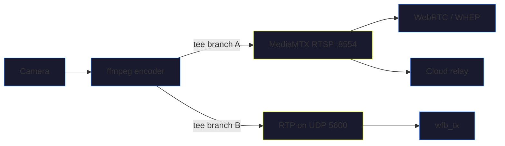

# Video Pipeline

The video pipeline takes a camera feed, encodes it to H.264 (or H.265), serves it locally via RTSP, and optionally transmits it over WFB-ng for long-range HD video or relays it to the cloud for remote viewing.

The pipeline runs as the `ados-video` systemd service (a native Rust binary) and is enabled on Tier 3+ boards.

## Pipeline flow


```mermaid
graph LR
    A[Camera] --> B[ffmpeg encoder]
    B -->|tee branch A| C[MediaMTX RTSP :8554]
    B -->|tee branch B| R[RTP on UDP 5600]
    R --> D[wfb_tx]
    C --> E[WebRTC / WHEP]
    C --> F[Cloud relay]

    style A fill:#1a1a2e,stroke:#3A82FF
    style B fill:#1a1a2e,stroke:#3A82FF
    style C fill:#1a1a2e,stroke:#DFF140
    style R fill:#1a1a2e,stroke:#DFF140
    style D fill:#1a1a2e,stroke:#3A82FF
    style E fill:#1a1a2e,stroke:#3A82FF
    style F fill:#1a1a2e,stroke:#3A82FF
```

**Camera** (V4L2 or CSI) feeds into **ffmpeg**, which encodes H.264 once and
writes it to two muxers through ffmpeg's `tee`. Branch A is the RTSP publish into
the local **MediaMTX**, which serves WebRTC on the LAN and feeds the cloud relay.
Branch B is an **RTP** copy on UDP 5600, which is what `wfb_tx` reads for the
radio.

The RTP framing is not decoration. `wfb_tx` needs each datagram to survive loss
on its own, and RTP (RFC 6184) gives that: a lost packet costs at most one NAL
fragment, where a lost chunk of a raw byte stream corrupts everything up to the
next start code. The receiver depayloads against the SDP at
`/etc/ados/wfb/video.sdp`.

When radio video goes dark, those are the two things to check on the drone: that
something is producing on UDP 5600, and that `/etc/ados/wfb/video.sdp` matches
what the encoder is emitting. `ados diag video` does both and names the hop that
stopped.

## Camera detection

The camera manager scans for cameras at startup:

1. Checks `/dev/video*` devices (V4L2)
2. Queries each with `v4l2-ctl` for capabilities
3. Filters for actual video capture devices (skips metadata-only nodes)
4. Sorts by priority: CSI first, then USB

If no camera is found, the video service stays in `idle` state and retries on USB hot-plug events.

```yaml
video:
  camera:
    source: "csi"     # csi | usb | ip, or a device path (/dev/video0) or RTSP URL
    codec: "h264"
    width: 1280
    height: 720
    fps: 30
    bitrate_kbps: 4000
```

<Note>
There is no test-pattern source value. To exercise the pipeline with no camera
attached, point `source` at an RTSP URL served by a local generator, or use the
hardware-free bench harness at `tools/atlas-sim-bench/`, which runs the real
agent against a synthetic camera and a viewable stream.
</Note>

## Encoding

The encoder builds one ffmpeg command line tuned for low latency, with the radio's
RTP copy as a second `tee` branch off the same encode:

```bash
ffmpeg -fflags nobuffer -flags low_delay \
  -probesize 32 -analyzeduration 0 \
  -f v4l2 -input_format mjpeg -video_size 1280x720 -framerate 30 \
  -i /dev/video0 \
  -c:v libx264 -b:v 4000k \
  -pix_fmt yuv420p -profile:v high -level:v 4.1 \
  -preset ultrafast -tune zerolatency \
  -g 15 -bf 0 -refs 1 -threads 4 -flush_packets 1 \
  -x264-params no-mbtree=1:sync-lookahead=0:rc-lookahead=0:sliced-threads=1:slices=4:scenecut=0 \
  -bsf:v h264_mp4toannexb,dump_extra=freq=keyframe \
  -max_delay 0 -muxdelay 0 -muxpreload 0 \
  -map 0:v -f tee \
  '[f=rtsp:rtsp_transport=tcp:max_delay=0:flush_packets=1]rtsp://127.0.0.1:8554/main|[f=rtp:payload_type=96:ssrc=0xCAFE:max_delay=0:flush_packets=1]rtp://127.0.0.1:5600?pkt_size=1316'
```

Key encoding flags:

| Flag | Purpose |
|------|---------|
| `-fflags nobuffer` | No input buffering |
| `-flags low_delay` | Minimize encoder latency |
| `-probesize 32 -analyzeduration 0` | Skip format analysis on a source whose format is already known |
| `-preset ultrafast -tune zerolatency` | Fastest encode, no B-frames, no lookahead |
| `-profile:v high -level:v 4.1` | H.264 High Profile for browser compatibility (`avc1.640029`) |
| `-g 15` | GOP is `fps/2`, so an IDR every 500 ms at 30 fps |
| `-threads 4` with `sliced-threads=1:slices=4` | Sliced threading emits each frame whole. Frame threading would hold four frames in flight, about 133 ms of pipeline delay at 30 fps. Boards with fewer than four cores use the two-thread frame-threaded form. |
| `dump_extra=freq=keyframe` | Repeats SPS/PPS in-band before every IDR, so a decoder that loses sync re-bootstraps at the next keyframe |
| `-muxdelay 0 -muxpreload 0` | ffmpeg's defaults here are about 0.7 s plus 0.5 s, in front of every downstream hop |

On boards with hardware encoders the encoder switches automatically based on the
board profile's `hw_video_codecs` field: `h264_v4l2m2m` through ffmpeg on the
Raspberry Pi, `mpph264enc` through GStreamer on Rockchip. Each arm repeats the
parameter sets per IDR with its own mechanism, so the recovery behaviour is the
same everywhere.

A bitrate change does not respawn the encoder unless it is a large one. The
adaptive ladder applies small rung moves in place, and only a change of 25% or
more restarts the process, because a respawn is a 1 to 2 second blackout.

### Recovering from a decoder desync

The GOP is the whole mechanism. Parameter sets in-band per IDR plus a 500 ms GOP
means a decoder that loses sync re-bootstraps within half a second.

There is no keyframe-on-demand path and none is planned. The shipped encoder
leaves expose no runtime control channel an IDR could be requested through, and
MediaMTX does not forward a browser's PLI to an RTSP publisher. The most a
request could save is the 0 to 500 ms wait, and forcing an IDR by respawning the
encoder costs several times that in blackout.

### H.264 vs H.265

H.264 is the default because it works everywhere. Browser players (MSE and WebRTC) expect it. H.265 saves bandwidth at the same quality, but WebRTC H.265 support in browsers is not consistent, so H.265 is not adopted as a launch default.

```yaml
video:
  camera:
    codec: "h264"   # Change to "h265" for bandwidth savings
```

<Warning>
If you switch to H.265, test your GCS player first. ADOS Mission Control's WebRTC client expects `avc1.640029` (H.264). H.265 streams may require a different playback path.
</Warning>

## MediaMTX

MediaMTX is a lightweight RTSP/WebRTC server bundled with the agent. The agent manages its lifecycle: starts it on boot, monitors it with a health check, and restarts it if it crashes.

MediaMTX serves two protocols from the same stream:

- **RTSP** at `rtsp://drone-ip:8554/main` for local network players (VLC, ffplay, GStreamer)
- **WHEP** (WebRTC) at `http://drone-ip:8889/main/whep` for browser playback

The agent writes the whole MediaMTX document itself, from one generator shared by
the air and ground profiles:

```yaml
# Managed by the agent, written to /etc/ados/mediamtx.yml
webrtcLocalUDPAddress: ":8189"
webrtcLocalTCPAddress: ""          # LAN profiles offer no TCP ICE candidate
webrtcIPsFromInterfaces: true
webrtcIPsFromInterfacesList: []
webrtcHandshakeTimeout: 10s
webrtcSTUNGatherTimeout: 2s
webrtcICEServers2: []              # LAN profiles gather no STUN
```

UDP ICE is pinned to one port, 8189, so a firewall rule is one line. STUN is
configured only on the cloud-relay profile: on a LAN session the browser connects
on host candidates, so a STUN entry would be pure handshake latency before the
first frame.

<Warning>
Do not hand-edit `/etc/ados/mediamtx.yml`. MediaMTX rejects an unrecognised key
outright, so a typo does not degrade the node, it leaves the node with no media
server at all. Change `video.*` in `/etc/ados/config.yaml` and let the agent
regenerate the file.
</Warning>

## Transport modes

The same encoded stream out of MediaMTX can ride four transport modes. The agent exposes them as an interactive switcher so the GCS can pick the right one for the current operating environment without restarting the pipeline.

| Mode | Path | Best for |
|---|---|---|
| RTSP local | Direct RTSP from the agent's port 8554 | Bench, lab, anything on the same LAN as the drone. |
| WFB-ng long-range | The encoder's second `tee` branch emits RTP (RFC 6184, payload type 96, SSRC `0xCAFE`, `pkt_size` 1316) on UDP 5600, which `wfb_tx -u 5600` injects over the RTL8812EU air interface | Field flight, long range, line of sight. |
| WebRTC remote | WHEP from MediaMTX over WebRTC, one-port ICE on `:8189` | Browser-based viewing on the local network. |
| Cloud relay | RTSP push to the cloud relay, WebRTC out to authenticated browsers | Off-LAN viewing without exposing the drone's IP, plus fleet aggregation. |

Mode selection follows a simple heuristic: if the GCS and the drone share a LAN, RTSP local or WebRTC. If the drone is in flight on the radio link, WFB-ng. If the operator is off-network, cloud relay. The GCS can override the heuristic with a manual pick.

## Recording

Recording is continuous and segmented, handled inside MediaMTX with no extra
encode pass:

```yaml
video:
  recording:
    enabled: false          # off by default
    path: "/var/ados/recordings"
    retention: "24h"        # how long segments are kept before deletion
```

Segments land under `/var/ados/recordings/<path>/%Y-%m-%d_%H-%M-%S-%f`, one
minute each. There is no whole-file capture and no maximum duration: the segment
set on disk **is** the pre-roll ring, so an arbitrary window before any event
stays extractable after the fact.

Cut a clip out of it with `ados record clip --path <stream> --start <rfc3339> --duration <seconds>`.

<Warning>
`retention` is the only thing bounding disk use, and it is time-based. A
high-bitrate day fills a small card well before 24 h elapses, so size it against
your card and your bitrate rather than leaving the default on a node you cannot
reach.
</Warning>

## Snapshots

Capture a JPEG snapshot from the live feed via the REST API:

```bash
curl -X POST http://localhost:8080/api/video/snapshot \
  -H "X-ADOS-Key: your_key"
```

Snapshots are saved to `/var/ados/recordings/` with a `snap-` prefix.

## OSD overlay

The OSD overlay can burn telemetry data into the video frame: altitude, speed, battery, GPS coordinates, and flight mode. The overlay uses ffmpeg's drawtext filter and pulls data from the state IPC socket.

## Pipeline health monitoring

The video service includes a watchdog that checks:

1. Is the ffmpeg process alive?
2. Is MediaMTX responding on its REST API (`localhost:9997`)?
3. Is the camera device still present?

If any check fails, the pipeline restarts automatically. The watchdog runs on a 10-second interval.

## Video status

From the terminal:

```bash
ados status
```

From the REST API:

```bash
curl http://localhost:8080/api/video \
  -H "X-ADOS-Key: your_key"
```

The response includes camera details, encoder state, MediaMTX status, recording state, and the WHEP URL for browser playback.

For a per-hop verdict rather than a summary, `ados diag video` samples the
reliable cumulative counters at each hop twice and names the hop that stopped.
See [Diagnostics](/drone-agent/diagnostics).

## More than one camera

Everything above describes the single `video.camera` block. A node with several
cameras declares a `video.cameras` list instead, one entry per video leg, each
served as its own MediaMTX path and WHEP endpoint. See
[Multi-camera](/drone-agent/multi-camera).
