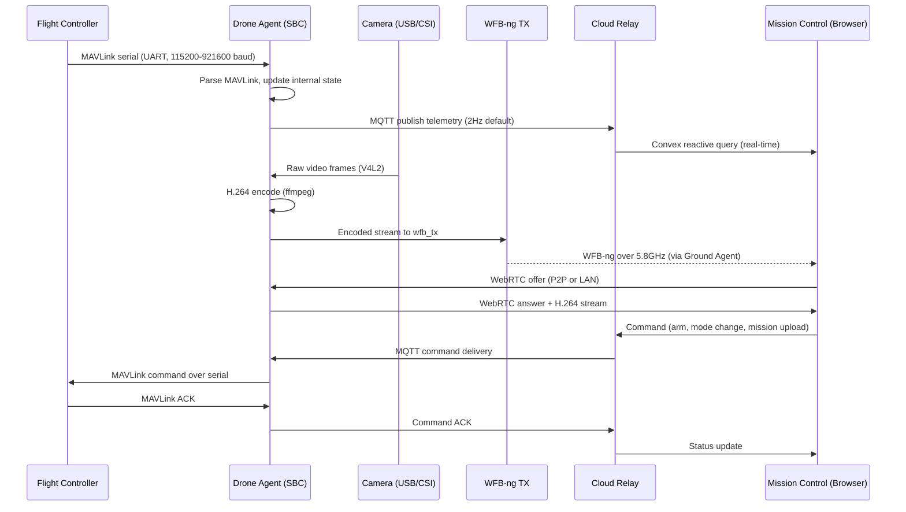
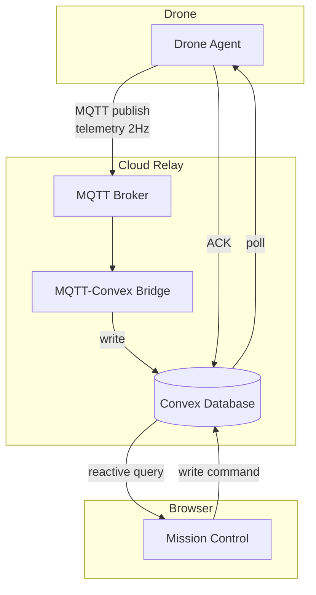

## The Big Picture

A drone with ADOS has two computers on board. The **flight controller** (FC) handles motor control, stabilization, GPS, and sensors. The **companion computer** (an SBC like a Raspberry Pi) runs the ADOS Drone Agent, which handles everything else: video, telemetry relay, cloud connectivity, scripting, and the REST API.

On the ground, your browser runs ADOS Mission Control. It talks to the drone either directly (USB, WiFi, or LAN) or through the cloud (MQTT + Convex). If you are using long-range WFB-ng video, a Ground Agent SBC sits between the radio and your laptop.

## Data Flow: FC to Browser

Here is what happens from the moment your flight controller boots to the moment you see telemetry in your browser.



## Three Connection Modes

Mission Control supports three ways to reach your drone. Each one works for different situations.

### 1. Direct USB (Field Mode)

The simplest setup. Plug a USB cable from your laptop to the flight controller. Mission Control uses WebSerial (a browser API) to talk MAVLink directly. No agent needed.

This is how you configure, calibrate, and flash firmware. It also works for bench testing.

```
Laptop USB --> FC (WebSerial, MAVLink)
```

**Latency:** Under 10ms. Instantaneous.

**When to use:** Bench work, FC configuration, firmware flashing, quick parameter changes.

### 2. LAN Direct (WiFi / Ethernet)

The drone agent runs a WebRTC server via mediamtx. If your laptop and the drone are on the same network (WiFi, USB tether, or Ethernet), Mission Control connects directly.

```
Laptop --> WiFi/Ethernet --> Agent (:8889 WebRTC, :8080 REST API)
```

**Latency:** 50-150ms for video. Under 100ms for telemetry.

**When to use:** Indoor testing, short-range field ops, development.

### 3. P2P via MQTT Signaling

When the drone has a 4G modem, it can connect over the internet. The agent and Mission Control exchange WebRTC signaling messages through an MQTT broker. Once the WebRTC connection is established, video and telemetry flow peer-to-peer.

```
Agent --> 4G --> MQTT broker --> Browser
Agent <-- P2P WebRTC --> Browser (after signaling)
```

**Latency:** 100-300ms for video depending on network conditions. Telemetry arrives via Convex reactive queries at 2-5Hz.

**When to use:** Beyond-visual-line-of-sight (BVLOS), remote monitoring, fleet management.

<Note>
Mission Control auto-detects the best transport. In **Auto** mode, it tries LAN Direct first (4 second timeout), then falls back to P2P MQTT (14 second timeout). You can also pin a specific transport manually using the video transport switcher in the UI.
</Note>

## The MAVLink Layer

MAVLink is the protocol that flight controllers speak. It is a binary protocol with 280+ message types. ADOS uses MAVLink v2 everywhere.

### On the Drone Agent

The agent connects to the FC over a serial UART (typically `/dev/ttyS0` or `/dev/ttyUSB0`). It auto-detects the port and baud rate on startup. Once connected, it:

1. **Sends a heartbeat** at 1Hz (identifies itself as `MAV_TYPE_ONBOARD_CONTROLLER`)
2. **Requests data streams** from the FC (attitude, GPS, battery, RC channels, sensor data)
3. **Proxies MAVLink** to any connected GCS (via WebSocket or cloud relay)
4. **Re-requests streams** every 30 seconds in case the FC missed the initial request
5. **Publishes state** to an internal IPC socket (`/run/ados/mavlink.sock`) so other agent services can read telemetry

### In Mission Control

The browser parses MAVLink binary frames directly. The adapter layer (`mavlink-adapter.ts`) handles 83 message types with full CRC validation. It feeds parsed data into Zustand stores that React components subscribe to.

Mission Control supports three firmware families:

| Firmware | Protocol | Config Panels | Status |
|----------|----------|---------------|--------|
| ArduPilot | MAVLink v2 | 36+ | Full support, tested on hardware |
| PX4 | MAVLink v2 | 36+ (shared) + 3 PX4-only | Full support, untested on hardware |
| Betaflight | MSP v1/v2 | 8 BF-only + 7 adapted | Full support via MSP codec |

## The Video Pipeline

Video flows through several stages. Here is what happens on the drone:

<Steps>
  <Step title="Camera Capture">
    The agent detects USB UVC cameras or MIPI CSI cameras at boot. It opens the device via V4L2 (Video for Linux).
  </Step>
  <Step title="H.264 Encoding">
    ffmpeg encodes the raw frames to H.264 (high profile, level 4.1, yuv420p). Low-latency flags are set: `nobuffer`, `low_delay`, minimal probe size.
  </Step>
  <Step title="RTSP Publishing">
    The encoded stream is published to mediamtx, a local RTSP/WebRTC server running on the agent.
  </Step>
  <Step title="Transport">
    The stream reaches your browser through one of three paths:
    - **LAN:** Browser connects to mediamtx via WHEP (WebRTC-HTTP Egress Protocol)
    - **P2P MQTT:** Browser and agent exchange SDP offers/answers via MQTT, then stream peer-to-peer
    - **WFB-ng:** Agent feeds the stream to `wfb_tx`, which broadcasts over 5.8GHz to the Ground Agent
  </Step>
  <Step title="Browser Playback">
    Mission Control plays the WebRTC stream natively. No plugins. The `<video>` element renders H.264 using the browser's hardware decoder.
  </Step>
</Steps>

## Cloud Relay Architecture

When your drone has internet access (4G modem or WiFi), it can connect to the cloud relay. This has two layers.

### Telemetry: MQTT + Convex

The agent publishes telemetry to an MQTT broker at 2Hz. An MQTT-to-Convex bridge service debounces updates (3 seconds per device) and writes them to the Convex database. Mission Control reads this data through Convex reactive queries, which push updates to the browser the instant they arrive in the database.

### Commands: Convex HTTP

When you click "Arm" or upload a mission in Mission Control, the GCS writes a command to the Convex database. The agent polls for pending commands, executes them by sending MAVLink to the FC, and ACKs back through Convex.



## The Ground Agent Role

The Ground Agent is the same ADOS Drone Agent software running in `ground-station` profile mode. At boot, it detects ground-station hardware (OLED display, GPIO buttons, RTL8812EU WiFi adapter, no flight controller) and automatically configures itself as a receiver.

Its job is simple: receive the WFB-ng video stream from the drone's radio, and make it available to your devices.

| Client Connection | How It Works |
|-------------------|-------------|
| Laptop over WiFi | Ground Agent runs a WiFi AP. Connect, open Mission Control in browser |
| Laptop over USB | Plug USB-C. CDC-NCM gadget creates a network interface. Works on macOS and Windows 11 natively |
| HDMI monitor | Ground Agent runs Chromium in kiosk mode, displaying the HUD directly |
| Phone / Tablet | Connect to WiFi AP, open browser, or use the ADOS Android app |

## State Management in Mission Control

Mission Control uses Zustand stores (27 total) with ring buffers for time-series data. Here are the key stores:

| Store | What It Holds |
|-------|--------------|
| `drone-manager` | Connected drones, active drone selection, protocol instances |
| `telemetry-store` | Attitude, GPS, battery, RC channels, sensors (ring buffers, 300 samples) |
| `mission-store` | Waypoints, mission items, upload/download state |
| `video-store` | Video transport state, health per transport mode, stream URLs |
| `settings-store` | User preferences (persisted to IndexedDB, version-migrated) |
| `ground-station-store` | Ground agent status, WFB-ng stats, network state, PIC arbiter |

Each store is independent. Components subscribe only to the slices they need. This keeps the UI responsive even when telemetry is arriving at 10Hz.

## What Happens When You Arm

Let's trace a concrete example. You click "Arm" in Mission Control.

1. **GCS** calls `protocol.arm()` on the active drone's protocol adapter
2. **Protocol adapter** encodes `MAV_CMD_COMPONENT_ARM_DISARM` (command #400) as a MAVLink v2 frame
3. **Transport** sends the binary frame over WebSocket (direct) or writes to Convex (cloud)
4. **Agent** (if cloud mode) polls the command, sends it over serial UART to the FC
5. **FC** validates the command, checks pre-arm conditions, arms the motors
6. **FC** sends `HEARTBEAT` with `base_mode` bit 7 set (armed flag)
7. **Agent** parses the heartbeat, updates IPC state, publishes via MQTT
8. **GCS** receives the updated heartbeat (direct or via Convex reactive query)
9. **UI** updates: the arm button turns green, the status bar shows "ARMED"

Total time from click to UI update: 50-200ms on LAN, 500-2000ms via cloud.

## Next Steps

<CardGroup cols={2}>
  <Card title="Quickstart: Mission Control" icon="display" href="/getting-started/quickstart-mission-control">
    Run the GCS right now. Five minutes, no hardware needed.
  </Card>
  <Card title="Architecture Deep Dive" icon="sitemap" href="/architecture/system-overview">
    Full architecture documentation with code-level details.
  </Card>
</CardGroup>
