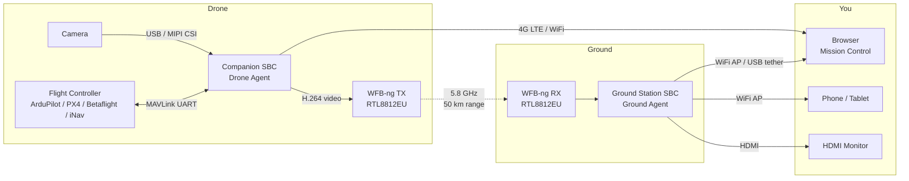

## A Software-Defined Drone Platform

ADOS (Autonomous Drone Operating System) is an open-source software stack for drones. It covers the full vertical: companion computer software on the drone, a browser-based ground control station, and a dedicated ground station node for long-range video.

You do not need to buy a specific drone. ADOS works with any flight controller running ArduPilot, PX4, Betaflight, or iNav. Plug in a companion computer (a Raspberry Pi, a Radxa board, or any Linux SBC), install the agent, and your drone gains video streaming, cloud telemetry, a REST API, scripting, and over-the-air updates.

The ground control station runs in your browser. No installs. Connect over USB, WiFi, or the internet. Configure your flight controller, plan missions, fly with a gamepad, flash firmware, and watch live video. All from one tab.

## The Three Products

ADOS ships as three open-source projects that work together.

<CardGroup cols={3}>
  <Card title="Mission Control" icon="display" href="/getting-started/quickstart-mission-control">
    Browser-based GCS. Configure, fly, plan missions, flash firmware. Supports ArduPilot, PX4, Betaflight, and iNav.
  </Card>
  <Card title="Drone Agent" icon="microchip" href="/getting-started/quickstart-drone-agent">
    Python software running on a companion computer aboard your drone. MAVLink proxy, video pipeline, cloud relay, REST API.
  </Card>
  <Card title="Ground Agent" icon="tower-broadcast" href="/getting-started/quickstart-ground-agent">
    Same codebase as the Drone Agent, running in ground-station mode. Receives long-range video and relays it to your laptop or phone.
  </Card>
</CardGroup>

## How They Fit Together

Here is the full picture. The flight controller runs ArduPilot, PX4, Betaflight, or iNav. The companion computer runs the Drone Agent. On the ground, a small SBC runs the Ground Agent. Your browser runs Mission Control.

<Note>
You do not need all three products at once. Mission Control works standalone with a USB cable to your flight controller. The Drone Agent works standalone with a 4G modem for cloud telemetry. The Ground Agent is only needed for long-range WFB-ng video links.
</Note>

## Who Is This For?

**FPV builders and pilots.** You already have a drone. You want better configuration tools, mission planning, and a modern GCS that runs in your browser instead of a desktop app from 2012.

**Researchers and engineers.** You need a scriptable drone platform with a REST API, a Python SDK, and the option to bolt on ROS 2 when your project needs it.

**Commercial operators.** You run mapping, inspection, or agriculture missions. You need reliable mission planning, fleet telemetry, and the ability to customize everything because your workflow is not generic.

**Students and educators.** You want to learn how drones work at every layer. ADOS is open source and documented. Read the code, modify it, break it, fix it.

**Hardware integrators.** You build drone hardware and want to run an open software stack on it. ADOS runs on 17 board profiles out of the box.

## What You Can Do Today

Here is a concrete list of things ADOS supports right now.

### Mission Control (GCS)
- Connect to ArduPilot, PX4, Betaflight, or iNav flight controllers over WebSerial (USB in browser)
- 36+ configuration panels: failsafe, PID tuning, power, OSD editor, ports, sensors, gimbal, LED, and more
- 9 calibration wizards: accelerometer, gyro, compass, level, airspeed, barometer, RC, ESC, CompassMot
- Mission planning with 7 pattern generators (survey grid, circular survey, corridor, search, spiral, crosshatch, perimeter)
- 3D mission simulation with terrain following
- Geofence and rally point management
- Gamepad and HOTAS flight control at 50Hz (Web Gamepad API)
- Firmware flashing via WebSerial (no external tools needed)
- Live video feed via WebRTC (LAN direct or P2P MQTT signaling)
- Demo mode with 5 simulated drones (no hardware needed to try it)
- SITL integration with real ArduPilot physics
- Dark theme. Responsive layout. Works on tablets.

### Drone Agent
- One-line install on any supported SBC (`curl | bash`)
- Auto-detects flight controller on serial ports
- Video pipeline: camera to H.264 to WFB-ng or WebRTC
- Cloud relay via MQTT (telemetry) and Convex (commands)
- REST API on port 8080 (FastAPI, OpenAPI docs included)
- Terminal UI (TUI) for SSH-based monitoring
- 25 CLI commands (`ados status`, `ados health`, `ados logs`, `ados pair`, and more)
- Python scripting SDK
- 17 board profiles (Raspberry Pi 4B, Radxa ROCK 5C, and others)
- OTA updates via `install.sh --upgrade`

### Ground Agent
- Same install script, auto-detects ground-station hardware
- Receives WFB-ng video and relays to browsers via WebRTC
- WiFi access point for laptop and phone connections
- USB tether support (CDC-NCM, plug-and-play on macOS and Windows 11)
- Physical UI: 1.3" OLED display and 4 tactile buttons
- HDMI kiosk mode for standalone field operation with a monitor and gamepad
- Captive portal setup wizard

## Licensing

All ADOS software is licensed under **GPLv3**. You can use it, modify it, and distribute it. If you distribute modified versions, those must also be GPLv3.

Hardware designs (schematics, PCB layouts, enclosures) are dedicated to the public domain under **CC0 1.0 Universal**. No attribution required, no share-alike obligation, no patent strings.

Read more in the [Open Source](/getting-started/open-source) section.

## Next Steps

<CardGroup cols={2}>
  <Card title="How It Works" icon="gears" href="/getting-started/how-it-works">
    Understand the data flow between the flight controller, agent, and GCS.
  </Card>
  <Card title="Quickstart: Mission Control" icon="display" href="/getting-started/quickstart-mission-control">
    Run the GCS in your browser in under 5 minutes. No drone needed.
  </Card>
  <Card title="Quickstart: Drone Agent" icon="microchip" href="/getting-started/quickstart-drone-agent">
    Install the agent on a companion computer.
  </Card>
  <Card title="Your First Flight" icon="plane" href="/getting-started/your-first-flight">
    Connect, arm, fly, and land. Step by step.
  </Card>
</CardGroup>
