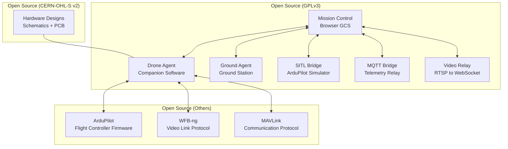

## Why Open Source?

ADOS exists because drone software should not be a black box. When your drone is flying 50 meters above a field carrying an expensive camera, you should be able to read every line of code that controls it. You should be able to fix bugs yourself, add features your workflow needs, and run the system on whatever hardware you choose.

Open source is not a marketing angle. It is the architecture decision. Every component of ADOS is open because that is the only way to build a platform other people can actually trust and build on.

## Licenses

### Software: GPLv3

All ADOS software repositories use the **GNU General Public License v3.0**. This includes:

- [ADOS Mission Control](https://github.com/altnautica/ADOSMissionControl) (TypeScript, Next.js)
- [ADOS Drone Agent](https://github.com/altnautica/ADOSDroneAgent) (Python)

**What GPLv3 means for you:**

| You can... | Details |
|-----------|---------|
| Use it for any purpose | Commercial, personal, educational, research. No restrictions. |
| Read and modify the source | Fork it, patch it, extend it. |
| Distribute copies | Share it with anyone. |
| Distribute modified versions | Ship your own version to customers. |
| Run it on any hardware | No hardware lock-in. |

| You must... | Details |
|-------------|---------|
| Keep it GPLv3 | If you distribute modified versions, they must also be GPLv3. |
| Include source code | If you distribute binaries, you must also make source available. |
| State changes | If you modify the code, note what you changed. |

| You cannot... | Details |
|---------------|---------|
| Make it proprietary | You cannot take GPLv3 code and release it under a closed license. |
| Add restrictions | You cannot add terms beyond what GPLv3 allows. |

<Note>
GPLv3 does not prevent commercial use. You can sell drones running ADOS. You can sell services built on ADOS. You can charge for support, customization, and integration. You just cannot close the source.
</Note>

### Hardware: CERN-OHL-S v2

Hardware designs (schematics, PCB layouts, mechanical drawings, enclosures) use the **CERN Open Hardware Licence v2, Strongly Reciprocal**. This is the standard copyleft license for open-source electronics, maintained by CERN and endorsed by OSHWA.

**What CERN-OHL-S v2 means for you:**

- You can manufacture boards from the designs
- You can modify the designs
- If you distribute modified hardware designs, they must also be CERN-OHL-S v2
- You must provide the design files to anyone who receives your hardware

This is the same license family used by KiCad, the Open Hardware Observatory, and many OSHWA-certified projects.

### Documentation: CC-BY-SA 4.0

Documentation (this site, guides, tutorials) uses **Creative Commons Attribution-ShareAlike 4.0**. You can share and adapt it, as long as you give credit and use the same license for derivatives.

## The Full Stack is Open

Here is what makes ADOS different from other open-source drone projects. It is not just one piece. It is the entire software vertical.

Compare this to the typical proprietary drone stack:

| Layer | Proprietary Stack | ADOS Stack |
|-------|------------------|-----------|
| Flight controller firmware | Closed or semi-open | ArduPilot / PX4 (open) |
| Companion computer software | Closed SDK, NDA required | ADOS Drone Agent (GPLv3) |
| Ground control station | Vendor-locked app | ADOS Mission Control (GPLv3) |
| Video link | Proprietary protocol | WFB-ng (open) |
| Cloud telemetry | Vendor cloud, subscription | Self-hosted or Altnautica cloud |
| FC configuration | Vendor-only tool | ADOS Mission Control (36+ panels) |
| Mission planning | Vendor-only tool | ADOS Mission Control (7 patterns) |
| Hardware designs | Proprietary | CERN-OHL-S v2 |

## How ADOS Compares to Other Open-Source Tools

### QGroundControl

QGC is the reference GCS for ArduPilot and PX4. It is open source (Apache 2.0 / GPLv3 dual license). It is a desktop Qt/C++ application.

ADOS Mission Control is a browser-based GCS. It runs in Chrome with no install. It includes features QGC does not have: gamepad flight control at 50Hz, WebSerial firmware flashing, MSP/Betaflight support, a built-in mission simulator, and demo mode. It also covers layers QGC does not touch: the companion computer agent, video pipeline, cloud relay, and ground station software.

QGC and Mission Planner are excellent tools. ADOS does not replace them for users who are happy with desktop apps. But if you want a browser-based workflow, full-stack coverage, or something you can embed in your own application, ADOS fills a gap.

### Mission Planner

Mission Planner is the ArduPilot-ecosystem GCS. Windows-only (.NET/WinForms), extensive feature set, tightly integrated with ArduPilot. It is open source (GPLv3).

ADOS Mission Control is cross-platform (runs anywhere a browser runs) and supports multiple firmware families (ArduPilot, PX4, Betaflight). If you are on macOS or Linux, or you need Betaflight support, Mission Control is an alternative.

### Betaflight Configurator

The Betaflight Configurator is a Chrome app / Electron app for configuring Betaflight flight controllers. ADOS Mission Control includes full MSP protocol support with 34 message decoders, 21 encoders, and 8 Betaflight-specific panels. You can configure a Betaflight FC from the same GCS you use for ArduPilot.

### DroneKit / pymavlink

DroneKit is a Python SDK for controlling MAVLink drones. It is no longer actively maintained. The ADOS Drone Agent builds on pymavlink (the actively maintained library) and provides a higher-level Python SDK, a REST API, a TUI, and systemd service management on top.

## What "Full Stack" Means Concretely

Here is a practical example. You want to build a drone that:

1. Streams live HD video to a browser
2. Lets you plan and execute survey missions from your phone
3. Reports telemetry to a cloud dashboard
4. Can be configured and calibrated without Mission Planner or QGC
5. Updates its software over the air
6. Works on hardware you chose yourself

With proprietary solutions, you buy the vendor's drone, use the vendor's app, connect to the vendor's cloud, and accept the vendor's update schedule. If the vendor goes out of business, you have a brick.

With ADOS, every layer is open. You pick the hardware. You run the software. You host the cloud (or use ours). You control the update cycle. If Altnautica disappears tomorrow, the code is on GitHub under GPLv3 and you can keep running it forever.

## Self-Hosting

ADOS is designed to work without any dependency on Altnautica's infrastructure.

**Mission Control** works standalone with zero backend. Connect over USB to your FC, plan missions, fly, configure. No account needed. No internet needed.

**Drone Agent** works standalone with zero cloud. It talks to the FC over serial, streams video over WFB-ng, and serves its REST API locally. Pairing with cloud relay is optional.

**Cloud features** (fleet dashboard, remote telemetry, community changelog) use Convex as the database. The Convex backend can be self-hosted. The MQTT broker is a standard Mosquitto instance. The video relay is a Node.js process. All of these are documented and Docker-ized in the `tools/` directory of the Mission Control repo.

## Contributing

We welcome contributions. Bug fixes, features, documentation, translations. See the [Contributing](/getting-started/contributing) guide for how to get started.

If you build something cool with ADOS, tell us about it in [Discord](https://discord.gg/uxbvuD4d5q). We feature community projects.

## FAQs

**Can I use ADOS commercially?**
Yes. GPLv3 allows commercial use. You can sell drones running ADOS, sell services built on ADOS, or use it in your business. The requirement is that if you distribute modified versions of the code, those must also be GPLv3.

**Can I use ADOS in a product without releasing my source?**
If you modify ADOS code and distribute the modified version (e.g., ship it on a product), you must release the source for your modifications under GPLv3. If you use ADOS unmodified, you still need to comply with GPLv3 distribution requirements (provide source access). If you use ADOS as a service (SaaS, not distributed), GPLv3 does not require source release (that would be AGPL).

**Can I use parts of ADOS in a non-GPL project?**
No. GPLv3 requires that any work based on GPL code is also GPL. If you need a permissive license, ADOS is not the right fit. Consider contributing upstream and talking to us about your use case.

**Is there a commercial license option?**
Not currently. Talk to us if you have a use case that GPLv3 does not cover.

**Who owns the copyright?**
Copyright is held by the original authors (Altnautica and contributors). Contributors retain copyright on their contributions and license them under GPLv3 via the contribution agreement.

## Next Steps

<CardGroup cols={2}>
  <Card title="Contributing" icon="code-pull-request" href="/getting-started/contributing">
    How to submit bug fixes, features, and documentation.
  </Card>
  <Card title="Community" icon="users" href="/getting-started/community">
    Join the Discord, ask questions, share your builds.
  </Card>
</CardGroup>
