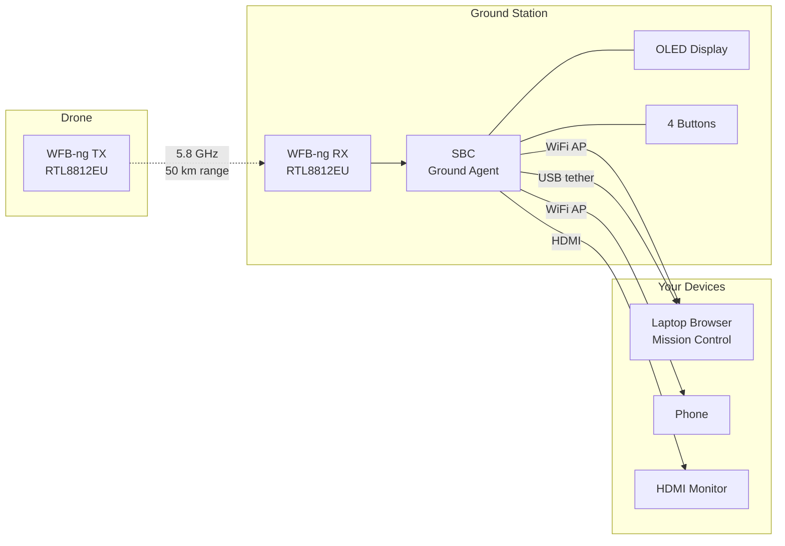

## What You Will Build

By the end of this page, you will have an ADOS Ground Agent running on a small SBC. It will receive WFB-ng video from your drone over a 5.8GHz radio link and relay that video to your laptop, phone, or HDMI monitor. You will be able to open Mission Control in your browser and see live video with under 100ms latency.

## What is the Ground Agent?

The Ground Agent is the same ADOS Drone Agent software running in **ground-station** profile mode. At boot, the agent detects ground-station hardware (OLED display, GPIO buttons, RTL8812EU WiFi adapter, and the absence of a flight controller) and automatically configures itself as a receiver instead of a transmitter.

Its core job: receive video from the air, relay it to your screen.



## Hardware You Need

### Minimum Setup (bench testing)

| Component | Example | Approx. Cost |
|-----------|---------|-------------|
| SBC | Raspberry Pi 4B (2GB+ RAM) | $45 |
| WiFi adapter | RTL8812EU USB dongle | $15-20 |
| Antennas | 2x 5.8GHz SMA (dipole or patch) | $10-15 |
| USB-C cable | For power or laptop tether | $5 |
| Power supply | 5V 3A USB-C | $10 |

### Full Standalone Setup (field use)

Add these for standalone operation without a laptop:

| Component | Purpose | Approx. Cost |
|-----------|---------|-------------|
| OLED display | 1.3" SSD1306 I2C | $5 |
| 4x tactile buttons | Physical controls | $2 |
| HDMI cable + portable monitor | Standalone video display | $50-100 |
| USB gamepad | Manual flight control in kiosk mode | $20-30 |

### On the Drone Side

Your drone needs the matching transmitter:

- ADOS Drone Agent running on a companion SBC
- An RTL8812EU USB WiFi adapter configured as WFB-ng TX
- A camera feeding the video pipeline

<Note>
The RTL8812EU chipset is the key component. It supports 5.8GHz monitor mode, which WFB-ng needs for its broadcast protocol. Other chipsets (RTL8812AU, RTL8811CU) may work but are less tested. The BL-M8812EU2 module is a common, affordable choice.
</Note>

## Installation

### Step 1: Flash Your SBC

Start with a fresh OS image on your SBC:

- **Raspberry Pi 4B:** Raspberry Pi OS Lite (Bookworm, 64-bit). Flash with Raspberry Pi Imager.
- **Radxa boards:** Official Debian or Ubuntu image from the Radxa wiki.

Enable SSH during image creation. Set a hostname (for example, `ados-ground`).

### Step 2: Boot and SSH In

Insert the SD card, connect Ethernet or WiFi, power on, and SSH in:

```bash
ssh pi@ados-ground.local
# or use the IP address
ssh pi@192.168.1.XX
```

### Step 3: Plug in the RTL8812EU Adapter

Connect the USB WiFi adapter. Verify it is detected:

```bash
lsusb | grep -i realtek
# Should show something like:
# Bus 001 Device 003: ID 0bda:8812 Realtek Semiconductor Corp. RTL8812EU
```

### Step 4: Install the Agent

```bash
curl -sSL https://raw.githubusercontent.com/altnautica/ADOSDroneAgent/main/scripts/install.sh | sudo bash
```

The install script detects the ground-station hardware fingerprint:

- RTL8812EU adapter present? Yes.
- Flight controller on serial ports? No.
- OLED on I2C bus? Check.
- GPIO buttons wired? Check.

Based on these signals, it automatically sets `profile: ground-station` in the configuration. No flags needed. No manual profile selection.

<Tip>
The auto-detect logic uses a scoring system. If it finds an RTL8812EU adapter and no flight controller, the score tips toward ground-station profile. You can override this in `/etc/ados/config.yaml` if needed, but you almost never have to.
</Tip>

### Step 5: Verify

```bash
ados status
```

You should see:

```
ADOS Drone Agent v0.5.3
Board: raspberry-pi-4b
Profile: ground-station

Services:
  ados-supervisor      active (running)
  ados-api             active (running)
  ados-health          active (running)
  ados-wfb             active (waiting for signal)
  ados-wifi-ap         active (running)  [SSID: ADOS-GS-abc123]

WFB-ng:
  Mode: RX
  Channel: 161 (5805 MHz)
  Signal: waiting for drone

WiFi AP:
  SSID: ADOS-GS-abc123
  IP: 10.0.0.1
  Clients: 0
```

The WiFi AP is already running. The WFB-ng receiver is listening for a drone signal.

## Connecting Your Devices

You have four ways to connect to the Ground Agent.

### Option 1: Laptop over WiFi

1. On your laptop, join the WiFi network `ADOS-GS-abc123` (the SSID includes your device ID)
2. Open your browser and go to `http://10.0.0.1:4000`
3. A captive portal / setup wizard may appear on first connection
4. Mission Control loads with the Ground Agent's Hardware tab visible
5. When the drone is in range, video appears automatically

### Option 2: Laptop over USB Tether

Plug a USB-C cable from the Ground Agent SBC to your laptop. The SBC exposes a CDC-NCM network gadget.

- **macOS (Sonoma+):** Works natively. A new network interface appears. The SBC is at `192.168.7.1`.
- **Windows 11:** Works natively with CDC-NCM. The SBC is at `192.168.7.1`.
- **Windows 10:** Falls back to RNDIS. May need a one-time driver install.
- **Linux:** Works natively. Run `ip addr` to find the new interface.

Open `http://192.168.7.1:4000` in your browser.

<Tip>
USB tether is the most reliable connection method. It does not depend on WiFi signal quality, it provides power to the SBC (if your laptop's USB port supplies enough current), and latency is consistently low.
</Tip>

### Option 3: HDMI Kiosk (No Laptop)

Connect an HDMI cable to the SBC and a portable monitor. The Ground Agent runs Chromium in kiosk mode, displaying the Mission Control HUD directly.

Pair a USB or Bluetooth gamepad for manual flight control. The HUD shows the video feed, attitude, altitude, battery, and GPS overlaid on the video.

This is the "backpack ground station" setup. SBC in a case, battery pack, portable monitor, and gamepad. No laptop required.

<Frame caption="Ground Agent OLED display showing link status, signal strength, and connected client count">
  
</Frame>

### Option 4: Phone or Tablet

Connect your phone to the Ground Agent's WiFi AP and open the browser. Mission Control is responsive and works on mobile screens.

For a better experience, the ADOS Android app (coming soon) provides native video decoding with lower latency than the browser path.

## The Physical UI

If you have wired the OLED display and 4 tactile buttons, the Ground Agent provides a physical interface.

### OLED Display (1.3" SSD1306, I2C)

Five screens, cycled by pressing the navigation buttons:

| Screen | Shows |
|--------|-------|
| Link | WFB-ng signal strength, FEC stats, lost packets, bitrate |
| Drone | FC status, armed state, flight mode, battery, GPS fix |
| GCS | Connected clients (WiFi, USB, HDMI), active video streams |
| Net | Active uplinks (WiFi client, Ethernet, 4G), IP addresses, data usage |
| System | CPU, RAM, temperature, disk, uptime |

### Buttons

Four GPIO buttons with short-press and long-press actions:

| Button | Short Press | Long Press |
|--------|------------|------------|
| Up | Previous screen | (reserved) |
| Down | Next screen | (reserved) |
| Select | Toggle detail view | Enter setup mode |
| Back | Return to main | Factory reset (requires confirm) |

## Setup Wizard

On first boot (or after factory reset), the Ground Agent serves a captive portal setup wizard at `http://10.0.0.1`. This webapp walks you through:

1. Setting the WFB-ng channel (must match the drone's TX channel)
2. Connecting to an existing WiFi network for internet access (optional)
3. Pairing with a Mission Control cloud account (optional)
4. Setting the WiFi AP password (optional, default is open)

The wizard is vanilla HTML and JS, about 50KB gzipped. It works on any device with a browser.

<Frame caption="Ground Agent setup wizard showing WFB-ng channel selection">
  
</Frame>

## Uplink Matrix

The Ground Agent can connect to the internet through multiple paths simultaneously. This lets it relay cloud telemetry from the drone to Mission Control even when your laptop is on the Ground Agent's local WiFi AP.

| Uplink | How | When |
|--------|-----|------|
| WiFi AP | Always running | Local device connections |
| WiFi client | Join existing network | Relay cloud telemetry, software updates |
| Ethernet | Plug in cable (Pi 4B has GbE) | Fixed ground station installations |
| USB tether | Laptop shares internet | Piggyback on laptop's connection |
| 4G LTE | SIM7600G-H modem (optional) | Remote field deployments |

Multiple uplinks can be active at the same time. The agent uses priority-based failover and health checks against `convex.altnautica.com` to pick the best route. If 4G is enabled, a configurable data cap (default 5GB/month) prevents runaway usage.

## Troubleshooting

**No WiFi AP visible:**
```bash
# Check if hostapd is running
sudo systemctl status ados-wifi-ap

# Check the WiFi adapter
iwconfig
```

**WFB-ng not receiving:**
```bash
# Check the WFB service
journalctl -u ados-wfb -n 30 --no-pager

# Verify the adapter is in monitor mode
iwconfig wlan1  # or whatever the RTL8812EU is assigned

# Make sure the channel matches the drone's TX channel
ados config show | grep channel
```

**USB tether not working:**
```bash
# Check if the USB gadget is set up
ls /sys/kernel/config/usb_gadget/ados-ncm 2>/dev/null

# The USB gadget is environment-gated by default
# Enable it in config if needed
ados config set usb_gadget.enabled true
sudo systemctl restart ados-usb-gadget-setup
```

## Next Steps

<CardGroup cols={2}>
  <Card title="Your First Flight" icon="plane" href="/getting-started/your-first-flight">
    You have the stack set up. Time to fly.
  </Card>
  <Card title="Hardware Tab" icon="display" href="/ground-agent/hardware-tab">
    Manage the ground station from Mission Control.
  </Card>
  <Card title="WFB-ng Configuration" icon="wifi" href="/drone-agent/wfb-ng">
    Tune channels, FEC, and power settings.
  </Card>
  <Card title="Physical UI" icon="toggle-on" href="/ground-agent/physical-ui">
    Customize OLED screens and button mappings.
  </Card>
  <Card title="Mesh & Distributed Receive" icon="share-nodes" href="/ground-agent/mesh-overview">
    Run two or three Ground Agents together for obstructed flight areas.
  </Card>
  <Card title="Three Deployment Roles" icon="shapes" href="/ground-agent/three-roles">
    direct, relay, receiver. When to pick which.
  </Card>
</CardGroup>
