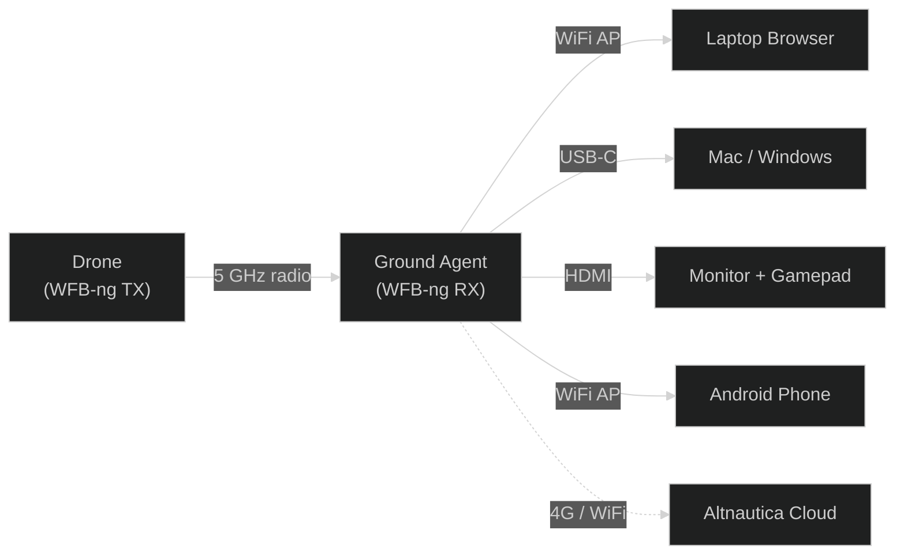

# ADOS Ground Agent

The Ground Agent is a small Linux SBC with a WiFi radio card that receives HD video from your drone and puts it on any screen you want. Your laptop browser, your phone, a monitor with a gamepad, or all three at once.

It runs the same ADOS Drone Agent codebase in a different profile. Same install script, same code, same updates. The hardware fingerprint at boot decides whether the SBC acts as a drone companion or a ground station.

<Frame caption="A bench ground station: Pi 4B with RTL8812EU adapter, OLED, and four buttons">
  
</Frame>

## What it does

The Ground Agent handles three jobs:

1. **Receives WFB-ng video** from your drone's RTL8812EU transmitter at up to 50 km range. Long-range, low-latency HD video over 5 GHz, no internet needed.

2. **Serves video and telemetry** to any connected client. WebRTC for video (50-100 ms latency), WebSocket for MAVLink telemetry. Your laptop opens a browser, your phone joins the WiFi, or you plug in HDMI and a gamepad.

3. **Bridges to the cloud** when you want remote observers. Connect the ground node to WiFi, Ethernet, or a 4G modem and telemetry flows to Altnautica cloud automatically.

## How it fits together

## Four ways to connect

Every client talks to the same endpoints on the Ground Agent. The only difference is the physical link.

| Client | Connection | Video latency | Best for |
|--------|-----------|---------------|----------|
| Laptop over WiFi | Join `ADOS-GS-XXXX` hotspot | 80-100 ms | Bench testing, training |
| Laptop over USB-C | Plug in a data cable | 40-70 ms | Indoor lab, wired reliability |
| HDMI + gamepad | Plug monitor and controller into the SBC | Under 60 ms | Field flying, no laptop needed |
| Android phone | Join WiFi or plug USB-C | 50-80 ms (app), 80-120 ms (browser) | Mobile field use |

All four can connect at the same time. One takes pilot-in-command (PIC), the rest watch.

## Key numbers

| Metric | Value |
|--------|-------|
| Codebase | Same as ADOS Drone Agent |
| Profile | `ground-station` (auto-detected) |
| License | GPLv3 |
| WiFi AP | `ADOS-GS-XXXX` on 2.4 GHz |
| USB tether IP | `192.168.7.1/24` |
| Video transport | WebRTC WHEP |
| MAVLink transport | WebSocket |
| REST API | Port 8080 |
| Physical UI | 128x64 OLED + 4 buttons |

## One codebase, two profiles

You do not install separate software for the ground side. The same `curl | bash` one-liner that installs the drone agent also installs the ground agent. On first boot, a score-based hardware fingerprint checks what is attached:

- OLED on I2C + GPIO buttons + RTL8812EU + no flight controller = **ground station profile**
- Flight controller on UART + GPS = **drone profile**

If the fingerprint is ambiguous, the OLED shows a pick-profile screen. You press a button and you are done.

<Note>
You can always override the auto-detected profile by setting `agent.profile: ground-station` in `/etc/ados/config.yaml`.
</Note>

## Bench hardware

The simplest ground station is a Raspberry Pi 4B, an RTL8812EU USB WiFi adapter, a small OLED, and four buttons. Total cost under 10,000 INR (about $120). Add an HDMI cable and a gamepad for standalone flight without a laptop.

Production boards (Radxa CM3 Lite tier, Radxa CM4 Pro tier) are smaller, more rugged, and support features like antenna diversity and internal 4G modems.

## Three deployment modes

A single Ground Agent runs in `direct` mode by default and that covers most setups. When the flight area has obstructions, when you want to extend coverage along a long corridor, or when you want a backup receiver in case the primary fails, you can deploy two or three Ground Agents together as a mesh. The roles in a mesh are:

- **direct** — single-node behavior. The default.
- **relay** — forwards drone fragments to a receiver elsewhere on the mesh.
- **receiver** — hub that combines fragments from itself and every paired relay.

[Read the Distributed Receive & Mesh overview](/ground-agent/mesh-overview) for when to use mesh and how it works. [Three Deployment Roles](/ground-agent/three-roles) covers the three options side by side.

## What is next

- [Supported Hardware](/ground-agent/supported-hardware) for the full parts list
- [Installation](/ground-agent/installation) to set up your ground station
- [WiFi AP](/ground-agent/wifi-ap) to connect your laptop
- [Setup and Pairing](/ground-agent/setup-and-pairing) for the first-time walkthrough
- [Mesh & Distributed Receive](/ground-agent/mesh-overview) when you need more than one Ground Agent
