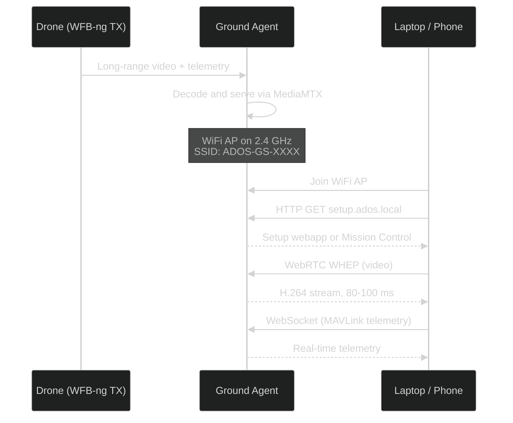

# WiFi AP Mode

The ground station creates a WiFi hotspot on boot. Join it from your laptop or phone, open a browser, and you have video and telemetry. No software to install, no radio drivers, no internet required.

## How it works

The onboard WiFi radio hosts the access point on 2.4 GHz. The dedicated video-link radio stays on the drone-facing receive job. These two radios do not interfere with each other.

## Connecting from a laptop

<Steps>
  <Step title="Join the WiFi network">
    Look for `ADOS-GS-XXXX` in your WiFi list. The `XXXX` suffix is the last four hex digits of the ground station device ID. Enter the passphrase printed on the case (default for bench builds: `ados-ground`).
  </Step>
  <Step title="Open the browser">
    Navigate to `http://192.168.4.1:4000` for Mission Control, or `http://setup.ados.local/` for the setup webapp. If Mission Control is not installed on the ground node, the setup webapp is the default landing page.
  </Step>
  <Step title="Start flying">
    Video and telemetry appear automatically. If a gamepad is connected to your laptop, Mission Control picks it up via the Web Gamepad API. Press any button on the gamepad to register it.
  </Step>
</Steps>

## Connecting from a phone

The flow is the same. Join the WiFi, open a browser (Chrome on Android, Safari on iOS), and navigate to `http://192.168.4.1:4000` or `http://setup.ados.local/`.

For Android users, the ADOS Android app provides a better experience with auto-discovery and native video decoding. See [Android Client](/ground-agent/android-client) for details.

<Note>
Android may show a "No internet" warning when you join the AP. This is expected. The ground station is a local network, not an internet gateway. Tap "Use without internet" or "Stay connected" to proceed.
</Note>

## Network details

| Setting | Value |
|---------|-------|
| SSID | `ADOS-GS-{short_id}` |
| Band | 2.4 GHz |
| Security | WPA2 |
| Subnet | `192.168.4.0/24` |
| Ground station IP | `192.168.4.1` |
| DHCP range | `192.168.4.10` to `192.168.4.200` |
| Client limit | ~3-4 video viewers comfortably on 2.4 GHz |

## Endpoints available over WiFi

Once connected to the AP, your browser can reach:

| Endpoint | URL | Purpose |
|----------|-----|---------|
| Mission Control | `http://192.168.4.1:4000` | Full GCS (if installed on the node) |
| Setup webapp | `http://setup.ados.local/` | First-time setup and config |
| WebRTC WHEP | `http://192.168.4.1:8889/ados/whep` or the WHEP URL reported by the Agent | Direct video stream |
| MAVLink WebSocket | `ws://192.168.4.1:8765/` | Raw MAVLink telemetry |
| Agent REST API | `http://192.168.4.1:8080/api/v1/` | Agent management |

## Multiple clients

Up to 3-4 devices can stream video simultaneously over the 2.4 GHz AP before throughput starts to degrade. Each client gets its own WebRTC session from MediaMTX. Telemetry over WebSocket is lightweight and supports many more clients.

Only one client at a time has pilot-in-command authority (the ability to send stick inputs to the drone). The first client with an active gamepad claims PIC. Other clients can request it through the Mission Control Hardware tab.

## WiFi AP configuration

You can change the AP settings from three places:

- **OLED menu:** Navigate to Network > WiFi AP
- **Setup webapp:** Open the Network page
- **Mission Control:** Open the Hardware tab > Network sub-view

Configurable settings:

- SSID name
- Passphrase
- Band (2.4 GHz only on Pi 4B, 2.4 or 5 GHz on boards with dual-band onboard radio)
- Channel auto-selection or manual pick
- Enable / disable toggle

<Warning>
If you disable the WiFi AP and have no other way to reach the ground station (no Ethernet, no USB tether), you will need to connect a monitor and keyboard to re-enable it. The OLED menu is the safest way to toggle the AP.
</Warning>

## 5 GHz AP on some boards

On production boards with dual-band onboard WiFi (separate from the RTL8812EU), you can run the AP on 5 GHz for higher throughput. This requires the WFB-ng radio to use a different 5 GHz channel. The agent handles channel deconfliction automatically.

The Pi 4B onboard WiFi supports 5 GHz but the driver is less reliable in AP mode at 5 GHz. Stick to 2.4 GHz on the Pi 4B.

## HTTPS and mixed content

If you load Mission Control from `https://command.altnautica.com` (the hosted version), your browser blocks HTTP connections to the local ground station. This is a browser security policy, not an ADOS limitation.

Two workarounds:

1. **Use the local build.** Open `http://192.168.4.1:4000` instead. All traffic stays HTTP on the local network.
2. **Run Mission Control on your laptop.** Clone the repo, run `npm run dev`, and open `http://localhost:4000`. Dev mode uses HTTP.

<Tip>
For field use, the local build on the ground station is the recommended approach. No internet, no HTTPS issues, lowest latency.
</Tip>

## Power

WiFi AP mode is usually powered from a wall adapter on the bench or a USB-C power bank in the field. Avoid relying on laptop back-power when multiple WiFi clients are streaming video.

[Power and Runtime](/ground-agent/power-and-runtime) has field runtime estimates.

## What is next

- [USB Tether](/ground-agent/usb-tether) for a wired alternative
- [Power and Runtime](/ground-agent/power-and-runtime) for field power sizing
- [HDMI Kiosk](/ground-agent/hdmi-kiosk) to fly with no laptop at all
- [Setup and Pairing](/ground-agent/setup-and-pairing) for the first-time walkthrough
